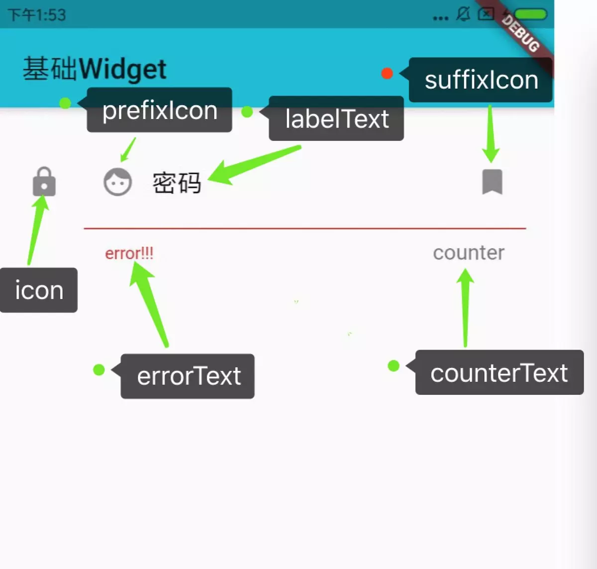
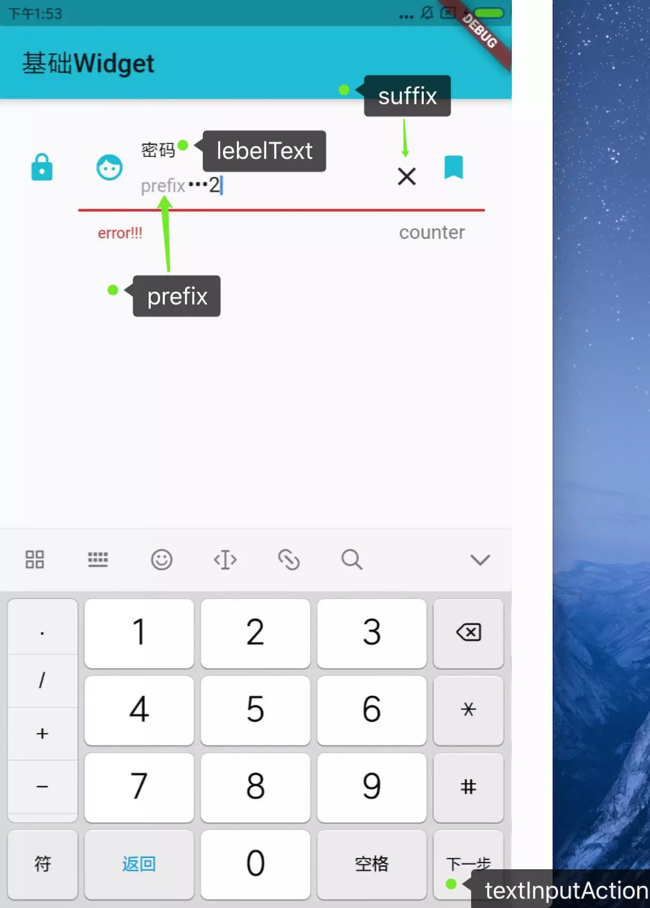

# Flutter TextField


**TextField**

| InputDecoration属性 | 作用 | 备注 |
| --- | --- | --- |
| icon | 文本框外，左侧的图标 |  |
| labelText | 标签，文本框获取焦点后移到左上角，字体变小 |  |
| hintText | 提示，文本框输入内容后不显示，无内容则显示 | 设置labelText，labelText正常显示时hintText不显示 |
| helperText | 文本框外，左下角的提示文字 | 设置errorText时，只显示errorText，不显示helperText |
| errorText | 文本框外，左下角的错误提示 |  |
| counterText | 文本框外，右下角 | 设置counter时，只显示counter |
| counter | 文本框外，右下角Widget |  |
| prefixIcon | 文本框内，最左边图标，一直显示 |  |
| prefix | 文本框内，prefixIcon右侧，内容输入区左侧，获取焦点后显示 |  |
| suffixIcon | 文本框内，最右侧图标，一直显示 |  |
| suffix | 文本框内，suffixIcon左侧，内容输入区右侧，获取焦点后显示 |  |
| border | 文本框边框 | 还有各种状态下的边框可以设置，比如focusedBorder等 。设置无边框要用InputBorder.none，用null无效 |
| contentPadding | 文本框内边距 |  |

| TextField属性 | 作用 | 备注 |
| --- | --- | --- |
| decoration | 设置各种提示/边框等 |  |
| controller | 文本控制，获取文本 |  |
| obscureText | 是否隐藏文字内容，为true时不显示内容 | 输入密码时常用 |
| keyboardType | 键盘类型，如数字键盘等 | TextInputType |
| textInputAction | 键盘右下角键的操作 | TextInputAction |
| maxLength | 最大长度，设置这个，文本框右下角counter的位置会默认显示输入字数和最大长度 “0/5” | 设置最大长度，不显示右下角字数的解决方案：1. 设置counterText=""； 2. 不采用maxLength: 8,用 inputFormatters: \[LengthLimitingTextInputFormatter(8)\] 代替 |
| maxLengthEnforced | 为true时，超过最大长度输入不进去；为false时，超过最大长度可继续输入 |  |
| textAlign | 文本位置，居中/靠左/靠右等 | TextAlign |
| textDirection | 文本显示方向，左到右/右到左 | textDirection |
| onChanged | 文本变化的时候会回调 | String |
| onEditingComplete | 输入完成的时候回调 | 在onSubmitted之前 |
| onSubmitted | 提交的时候会回调 | String |




textfield默认.jpg




textfield获取焦点后.jpg

开发中的问题及解决：

1.  TextField输入很多文字，会横向滑动，不能自动换行
    解决：同时设置minLines和maxLines。只设置maxLines的话，输入框的初始高度会很高；只设置minLines的话，只能显示minLines行，如果为1，只能横向滑动，大于1的时候，垂直滑动。

2.  输入不符合要求的时候，errorText怎么设置并显示
    解决：新建一个类，继承自TextField，对其功能进行扩展

```
import 'package:flutter/gestures.dart';
import 'package:flutter/material.dart';
import 'package:flutter/services.dart';

class EditText extends TextField {
    EditText({
        Key key,
        controller,
        focusNode,
        decoration = const InputDecoration(),
        TextInputType keyboardType,
        textInputAction,
        textCapitalization = TextCapitalization.none,
        style,
        strutStyle,
        textAlign = TextAlign.start,
        textDirection,
        autofocus = false,
        obscureText = false,
        autocorrect = true,
        maxLines = 1,
        minLines,
        expands = false,
        maxLength,
        maxLengthEnforced = true,
        onChanged,
        onEditingComplete,
        onSubmitted,
        inputFormatters,
        enabled,
        cursorWidth = 2.0,
        cursorRadius,
        cursorColor,
        keyboardAppearance,
        scrollPadding = const EdgeInsets.all(20.0),
        dragStartBehavior = DragStartBehavior.start,
        enableInteractiveSelection,
        onTap,
        buildCounter,
        errorText,
        clearText = false,
    }) : super(
        key : key,
        controller: controller,
        focusNode: focusNode,
        decoration: decoration.copyWith(
            errorText: errorText,
            suffix: clearText ? new GestureDetector(
                onTap: () {
                    controller.clear();
                },
                child: new Icon(Icons.clear),
            ) : null,
        ),
        keyboardType:keyboardType,
        textInputAction:textInputAction,
        textCapitalization:textCapitalization,
        style:style,
        strutStyle:strutStyle,
        textAlign:textAlign,
        textDirection:textDirection,
        autofocus:autofocus,
        obscureText:obscureText,
        autocorrect:autocorrect,
        maxLines:maxLines,
        minLines:minLines,
        expands:expands,
        maxLength:maxLength,
        maxLengthEnforced:maxLengthEnforced,
        onChanged:onChanged,
        onEditingComplete:onEditingComplete,
        onSubmitted:onSubmitted,
        inputFormatters:inputFormatters,
        enabled:enabled,
        cursorWidth:cursorWidth,
        cursorRadius:cursorRadius,
        cursorColor:cursorColor,
        keyboardAppearance:keyboardAppearance,
        scrollPadding:scrollPadding,
        dragStartBehavior:dragStartBehavior,
        enableInteractiveSelection:enableInteractiveSelection,
        onTap:onTap,
        buildCounter: buildCounter,
    );
}
```

应用：

```
  String errorText;
  TextEditingController controller = new TextEditingController();

 @override
  Widget build(BuildContext context) {
    return new Scaffold(
        appBar: new AppBar(
            title: new Text("基础Widget"),
        ),
        body: new SingleChildScrollView(
            child: new Container(
                child: new EditText(
                    decoration: new InputDecoration(
                        hintText: "input your account",
                        contentPadding: EdgeInsets.fromLTRB(15, 10, 15, 10),
                        border: new OutlineInputBorder(
                            borderSide: new BorderSide(
                                width: 1.0,
                                color: Colors.cyan,
                            )
                        ),
                    ),
                    controller: controller,
                    onEditingComplete: _check,
                    errorText: errorText,
                    clearText: true,
                ),
            ),
        ),
    );
  }

  _check() {
      setState(() {
          if(controller.text.contains("2b")) {
              errorText = "2bhhhh";
          } else {
              errorText = null;
          }
      });
  }

```