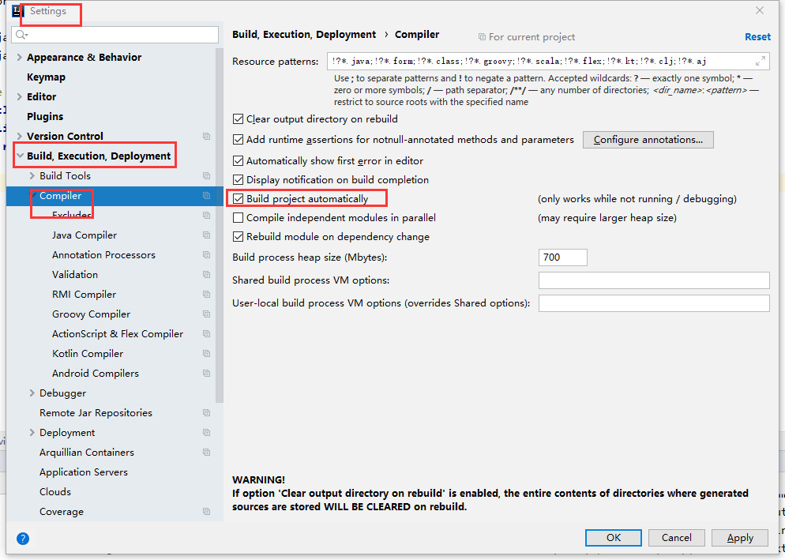
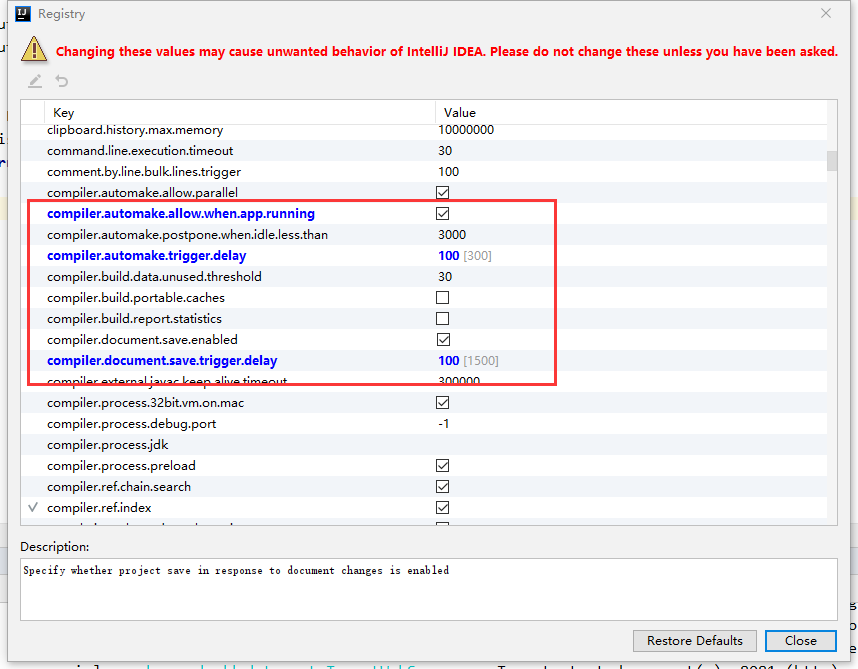
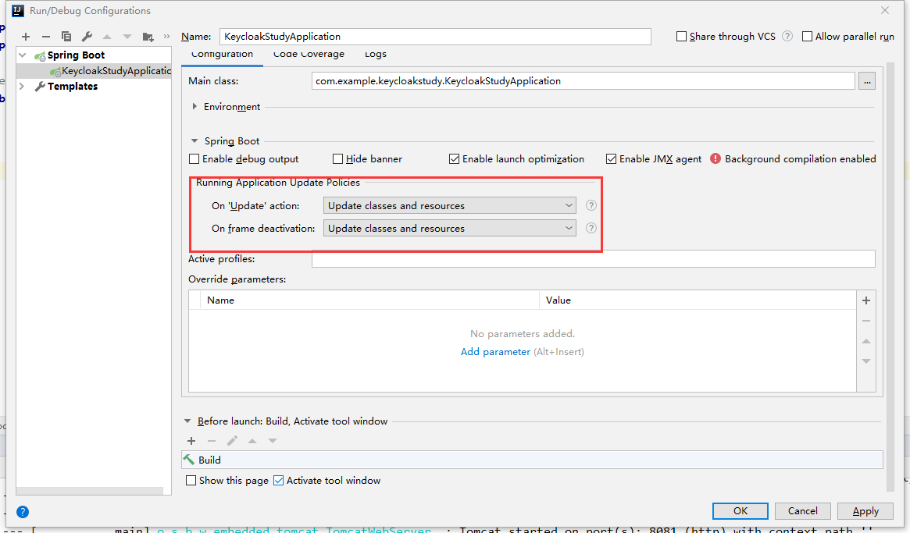
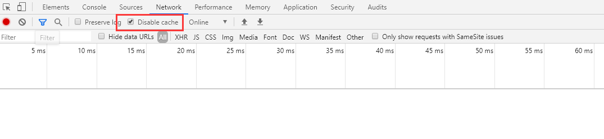

# [转载:SpringBoot 在IDEA中实现热部署](https://www.cnblogs.com/ifme/p/12593445.html)

## 

> 好的热部署让开发调试事半功倍，这样的“神技能”怎么能错过呢， 使用过IDEA的童鞋赶紧进来撸一把吧。

## 学习目标

快速学会在项目中使用热部署插件运行项目，提高开发效率。

## 具体步骤

> idea版本是2019.3

### 一、开启IDEA的自动编译（静态）

具体步骤：打开顶部工具栏 `File` -> `Settings` -> `Build` -> `Compiler` 然后勾选 `Build project automatically`。

[](https://img2020.cnblogs.com/blog/1580998/202003/1580998-20200329170557565-1270727011.png)

### 二、开启IDEA的自动编译（动态）

具体步骤：同时按住 `Ctrl + Shift + Alt + /` 然后进入`Registry` ，勾选自动编译并调整延时参数。

- `compiler.automake.allow.when.app.running` -> 自动编译
- `compile.document.save.trigger.delay` -> 自动更新文件

> PS：网上极少有人提到compile.document.save.trigger.delay 它主要是针对静态文件如JS CSS的更新，将延迟时间减少后，直接按F5刷新页面就能看到效果！

[](https://img2020.cnblogs.com/blog/1580998/202003/1580998-20200329170606786-1840655839.png)

### 三、开启IDEA的热部署策略（非常重要）

具体步骤：`顶部菜单`- >`Edit Configurations`->`SpringBoot插件`->`目标项目`->`勾选热更新`。

[](https://img2020.cnblogs.com/blog/1580998/202003/1580998-20200329170615093-337869664.png)

### 四、在项目添加热部署插件（可选）

> 温馨提示：
> 如果因为旧项目十分臃肿，导致每次都自动热重启很慢而影响开发效率，笔者建议直接在POM移除`spring-boot-devtools`依赖，然后使用Control+Shift+F9进行手工免启动快速更新！！

具体步骤：在POM文件添加热部署插件

```xml
<dependency>
      <groupId>org.springframework.boot</groupId>
      <artifactId>spring-boot-devtools</artifactId>
      <scope>runtime</scope>
 </dependency>
```

### 五、关闭浏览器缓存（重要）

打开谷歌浏览器，打开`F12`的`Network`选项栏，然后勾选【✅】Disable cache 。

[](https://img2020.cnblogs.com/blog/1580998/202003/1580998-20200329170624610-1141437239.png)

热部署到底有多爽呢，用渣渣辉的话来说，只需体验三分钟，你就会干我一样，爱上这款呦西。

