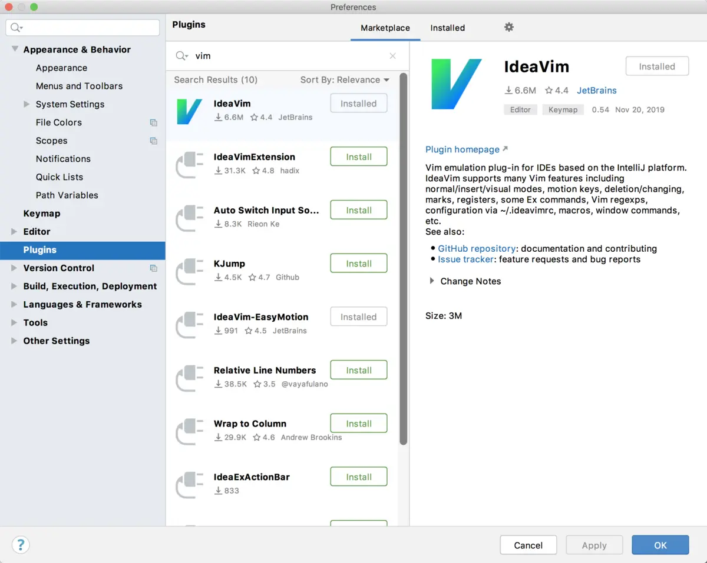
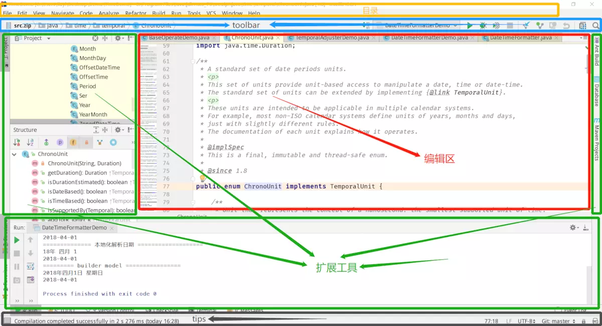
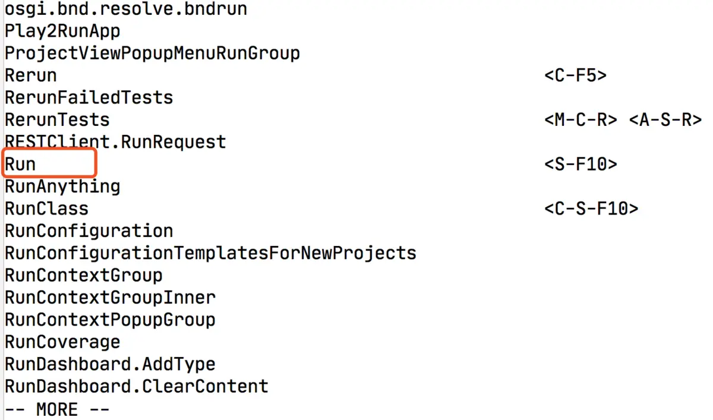
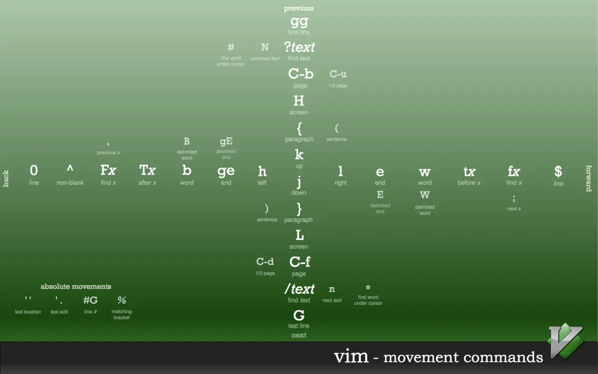
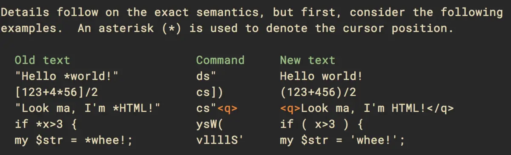

Clipped from: https://www.jianshu.com/p/fd82bbed2c25

# ideavim键盘流

- 最后更新于2019-12-06

作为一个vimer，不管使用什么IDE或者编辑器，安装完成后的第一步就是安装vim插件。

我的日常开发中使用最多的就是IDEA，对应的vim插件为[IdeaVim](https://links.jianshu.com/go?to=https%3A%2F%2Fgithub.com%2FJetBrains%2Fideavim)。但是其实想要在集成开发环境中顺手的完成代码的编写，其实单单熟练vim是不够的，毕竟IDEA的功能更多更复杂。所以除了编辑文本之外，让具体的IDE工具和vim配合起来才能达到更加完美的效率。

本篇文章的目的是阐述如何在idea中顺畅的使用vim编写代码以及完成常规的操作。所以不会对vim的基本使用做过多的描述，如果有兴趣了解vim的更多信息，请移步[vim官网](https://links.jianshu.com/go?to=https%3A%2F%2Fwww.vim.org%2F)或者[vimscript脚本](https://links.jianshu.com/go?to=http%3A%2F%2Flearnvimscriptthehardway.onefloweroneworld.com%2F)进行了解和学习。

## 1. 安装ideavim

安装的部分就不多说了，打开：设置->插件->浏览依赖->搜索vim安装即可。



ideavim

ideavim已经支持vim大多数的操作，但是仍然是不完整实现。比如列表跳转和很多不常用的命令。此外，如果vim插件和已有的快捷键设置有冲突，可以在vim设置中进行调整，一面引起快捷键的混用。

## 2. idea的核心操作逻辑

idea毕竟是ide，有着完整的代码开发功能。熟悉idea的设计逻辑和模块应该也是调高效率的必走之路了。

### 2.1. 布局



布局

idea的设计布局分为五部分，从上往下分别是：目录(黄色)，toolbar(蓝色)，编辑区(红色)，扩展工具(绿色)，tips(灰色)。详细如图，正常来说vim的作用范围也就在代码编辑区，其他的操作都需要借助idea本身来完成。

除了基本布局之外，idea总是会弹出对话框，比如新建文件，搜索文件等等。这些对话框中的输入操作vim是未启用状态。所以在对话框中输入命令时vim不会生效这一点必须清楚，避免使用的时候引起环混乱。

### 2.2. 逻辑

开发过idea插件的人都知道，在idea中，任何目录选项上的点击操作，工具栏上的按钮都会被映射为一个`action`。即点击对应的按钮或者选项，执行相应的`action`。理解很简单，这就是MVC的思想，比如springmvc， 一个访问路径映射为一个控制器中的方法这样子。

明白`action`映射这一点很重要。因为ideavim的插件支持使用vim命令执行对应的`action`。所以，这个设计逻辑就打通了vim和idea的交互，使得我们可以在vim中完成所有和idea相关的操作。

### 2.3. 常规操作

vim的定位是文本编辑。所以在idea中一般情况下vim快捷键和命令生效的基本条件就是当前窗口焦点在编辑区。这是最基础的条件，如果你当前的快键键在`Project`或者`Run`这些侧边栏中，按vim的命令肯定是不会生效的。

明白了基本条件，那我们要做的第一件事也是最重要的事情就是在idea中，如何快速的将焦点回到的编辑区。答案是：


Esc

这应该是使用vim的人最能接受的快捷键了。所以，到这里基本的操作思路就很明确，当前的焦点要么在编辑区外，要么在编辑区内。而返回编辑区的操作很简单，就是`Esc`。当焦点在编辑区的时候，就可以随心所欲的使用vim的指令和快捷键了。

## 3. 配置

有了idea基本的了解之后，我们就可以着手配置自己的vim了。ideavim插件的配置通常是`~/.ideavimrc`，所以将自己的配置脚本写在对应的文件中即可。当然如果你已经有了自己的vim配置文件在`~/.vimrc`下，那只需要在ideavim的配置文件中添加一行命令即可全部读取映射过来

```
source ~/.vimrc
```

当然，只支持部分vimrc的参数，所以并不是所有的vimrc中的配置都会生效

## 4. 在vim中执行idea的action

为了执行idea中的`action`，ideavim有两个额外的命令来支持这一操作。

- `:actionlist [pattern]`
- `:action {actionName}`

第一个命令actionlist是帮助查看idea中有哪些命令。第二个命令是执行对应的`action`这样子。有了这两个命令的帮助我们就可以在ideavim的配置文件中使用map命令来映射idea的`action`到vim的快捷键中。

比如使用`actionlist`命令查看`run`和`debug`的`action`名称：



Run

然后就可以在`~/.ideavimrc`使用`map`命令映射自己习惯的快捷键，这里我把`zd`映射为`Debug`，`zr`映射为`Run`

```
" 设置debug为 zd
:nnoremap zd :action Debug<CR>
" 设置run 为 zr
:nnoremap zr :action Run<CR>
```

这里，我没有测试idea中使用普通的`*map`隐射命令会不会引起递归调用，但是`*noremap`有效的状态下使用`*nnoremap`总是没有错的。

其实我想表达的重点到这里就差不多了，核心点就是在vim中调用idea的`action`，从而使得vim扩展到idea中的所有功能这样子。

当然，记住几个idea核心快捷键在大多数情况下总是有用的。

- `Ctrl + Shift + A` 打开action快速搜索窗口
- `Alt + 数字/字母` 打开对应的扩展工具栏
- `Double Shift` 快速搜索
- `Ctrl + Tab` 打开Switcher，进行扩展工具栏或者文件的快速切换

## 5. 常用技巧

### 跳转

掌握跳转技巧在阅读代码和debug的时候，非常有用。

说明：`` 代表组合键 `Ctrl` + `x`

- `` 跳转到当前标识符的定义位置 （相当于在当前光标位置的单词上按住ctrl用鼠标点击）
- `` 回退一步 (go back)
- `` 前进一步 (go forward)
- `'.` 跳转到之前修改位置
- `''` 在前一次跳转位置与当前位置间切换
- 行号 `G` 或 `:行号<回车>` 跳转到某一行
- `gg` 跳转到文件开头
- `G` 跳转到文件末尾
- `H` 跳转到屏幕顶端（如果设置了set so=n，则跳转到第n行）
- `L` 跳转到屏幕底端（如果设置了set so=n，则跳转到倒数第n行）
- `M` 跳转到屏幕中间
- `f` 或 `F` 跳转到本行某个字符，小写`f`向右查找，大写`F`向左查找。用`;`或`,`在匹配间切换
- `t` 或 `T` 跳转到本行某个字符之前，小写`t`向右查找，大写`T`向左查找。用`;`或`,`在匹配间切换
- `/正则表达式` 跳转到下一个匹配。用`n`或`N`在匹配间切换。
- `?正则表达式` 跳转到上一个匹配。用`n`或`N`在匹配间切换。

附上一张vim跳转图，方便理解。




vim十字跳转快捷键参考图

##  6.插件模拟

到目前位置，ideavim一共支持四个插件的模拟，分别为：

- easymotion 快速跳转
- surround 快捷环绕操作，比如添加修改括号双引号等等
- multiple-cursors 多指针操作
- commentary 快捷注释操作

当然对于以上插件的模拟本质是就是扩展几个核心命令，并不是完整实现插件的所有功能。

#### EasyMotion

EasyMotion依赖于[IdeaVim-EasyMotion](https://links.jianshu.com/go?to=https%3A%2F%2Fplugins.jetbrains.com%2Fplugin%2F13360-ideavim-easymotion%2F) 和 [AceJump](https://links.jianshu.com/go?to=https%3A%2F%2Fplugins.jetbrains.com%2Fplugin%2F7086-acejump%2F) 两个插件，所以使用之前确保已经完成安装。安装完成之后，在ideavimrc中添加下面这行设置开启。

```
set easymotion
```

令人欣慰的是EasyMotion的模拟支持所有原生插件的功能。查看[所有支持命令](https://links.jianshu.com/go?to=https%3A%2F%2Fgithub.com%2FAlexPl292%2FIdeaVim-EasyMotion%23supported-commands)

#### surround

模拟的插件为 [vim-surround](https://links.jianshu.com/go?to=https%3A%2F%2Fgithub.com%2Ftpope%2Fvim-surround)。插件本身很简单，就是提供快捷的对操作。比如添加括号，双引号等等。

```
set surround
```

支持的命令有：`ys`, `cs`, `ds`, `S`。常见用法如下，将光标停留在*所在位置，输入对应的命令(Command)，即可将左侧（Old text）的内容修改为右侧（New text）的内容。



vim-surround examples


#### multiple-cursors

多光标[vim-multiple-cursors](https://links.jianshu.com/go?to=https%3A%2F%2Fgithub.com%2Fterryma%2Fvim-multiple-cursors)操作在vim中其实很爽，但是IDEA有语法解析和识别，所以将变量重命名的action绑定到vim快捷键上明显来的更方便些。具体可参考我下面的的ideavimrc中的内容。

官方readme里说支持的命令的有：``, ``, ``, `g`，不知道为啥我就是没按出来。不知道A代表啥，`command`、`option`和`ctrl`键我都试了，貌似都不行。如果有知道的同学可以评论下，被自己蠢哭了，还没google到这个是什么含义。

#### commentary

一个方便添加注释的插件[commentary.vim](https://links.jianshu.com/go?to=https%3A%2F%2Fgithub.com%2Ftpope%2Fvim-commentary)，相当有用，具体用法参考原生插件的readme。

IdeaVim模拟的命令有： `gcc`, `gc + motion`, `v_gc`

## 7. 我自己的ideavimrc

本来添加了大量的映射，后来删除了大多数，大部分都转向了idea的double shift来快速搜索和执行。

```

let mapleader = " "
set easymotion
set surround
set gdefault

set smartcase

" use system clipboard
set clipboard=unnamedplus,unnamed

" Allow backspace and cursor keys to cross line boundaries
set whichwrap+=<,>,h,l

" black hole register
vmap <backspace> "_d
vmap <del> "_d

" ============================================================================
" expand and collapse
" ============================================================================
nmap zO :action ExpandAllRegions<CR>
nmap zo :action ExpandRegion<CR>
nmap zc :action CollapseRegion<CR>
nmap zC :action CollapseAllRegions<CR>

" Quit insert mode
inoremap jj <Esc>
inoremap jk <Esc>
inoremap kk <Esc>

" Quit visual mode
vnoremap v <Esc>

" Move to the start of line
nnoremap H ^

" Move to the end of line
nnoremap L $

" Redo
nnoremap U <C-r>

" Yank to the end of line
nnoremap Y y$

" Insert one new line before caret without changing mode, it still in normal mode
nnoremap <S-CR> O<ESC>

" Insert one new line after caret without changing mode, it still in normal mode
nnoremap <CR> o<ESC>

" Reload the .ideavimrc
nnoremap <leader>lr :source ~/.ideavimrc<CR>


" Display the action list IdeaVim supports
nmap <leader>ll      :actionlist<CR>

" ============================================================================
" IDE actions
" ============================================================================

nnoremap gc              :action GotoClass<CR>
nnoremap gf              :action GotoFile<CR>
nnoremap gs              :action GotoSymbol<CR>
nnoremap ga              :action GotoAction<CR>
nnoremap gr              :action RecentFiles<CR>


nnoremap gd              :action GotoDeclaration<CR>
nnoremap gj              :action QuickJavaDoc<CR>
nnoremap gu              :action FindUsages<CR>
nnoremap gi              :action GotoImplementation<CR>
nnoremap gl              :action GotoLine<CR>


nnoremap ha              :action SaveAll<CR>
nnoremap hs              :action $SelectAll<CR>
nnoremap hf              :action ReformatCode<CR>
nnoremap hi              :action ImplementMethods<CR>

nnoremap rc              :action RunClass<CR>
nnoremap rr              :action Run<CR>
nnoremap rs              :action Stop<CR>
nnoremap re              :action DebugClass<CR>
nnoremap rd              :action Debug<CR>

nnoremap ws              :action ActivateStructureToolWindow<CR>
nnoremap wt              :action ActivateTerminalToolWindow<CR>
nnoremap wp              :action ActivateProjectToolWindow<CR>
nnoremap wr              :action ReopenClosedTab<CR>

```

## 参考

- [github: ideavim](https://links.jianshu.com/go?to=https%3A%2F%2Fgithub.com%2FJetBrains%2Fideavim)