Clipped from: https://how2j.cn/k/idea/idea-parent-child/2051.html

通过 maven 可以创建父子-聚合项目。 所谓的父子项目，即有一个父项目，有多个子项目。
这些子项目，在业务逻辑上，都归纳在这个父项目下，并且一般来说，都会有重复的jar包共享。
所以常用的做法会把重复的 jar 包都放在父项目下进行依赖，那么子项目就无需再去依赖这些重复的 jar 包了。

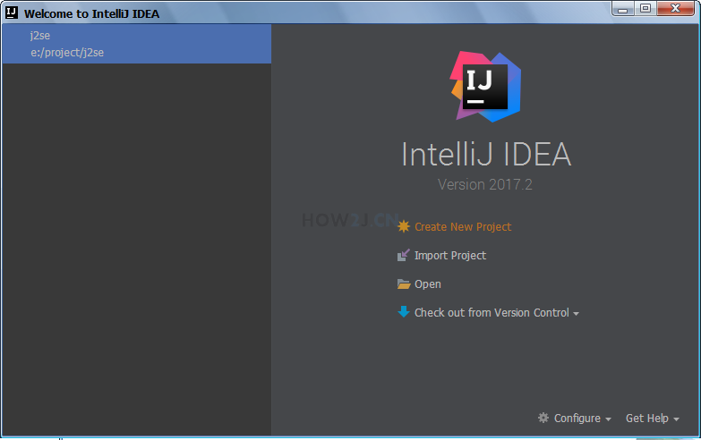

\1. 左边选择Maven
\2. 勾选Create from archetype
\3. 选择org.apache.maven.archetypes:maven-archetype-quickstart
\4. Next

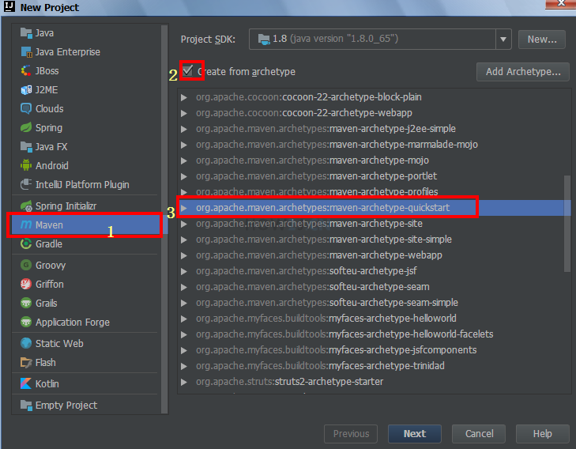

输入如图所示项目参数

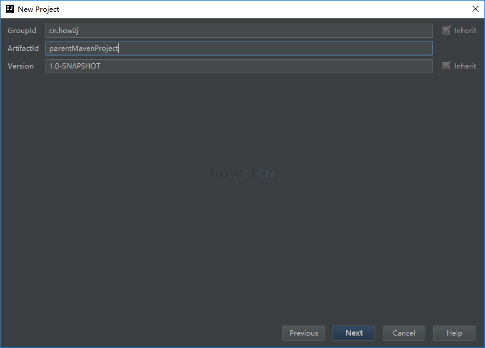

经过上个知识点的[IDEA设置](https://how2j.cn/k/idea/idea-maven-config/1353.html#step5752)设置后，就可以看到如图所示的maven设置

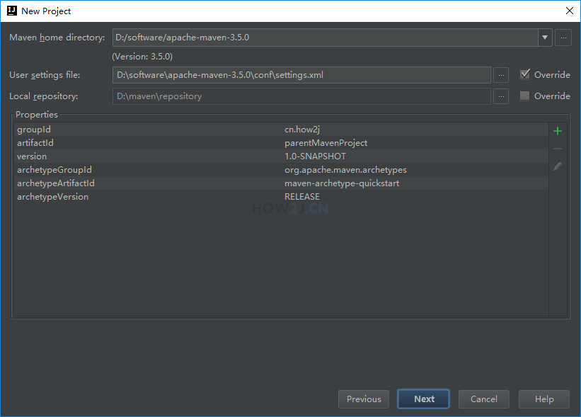

如图所示，然后点 Finish

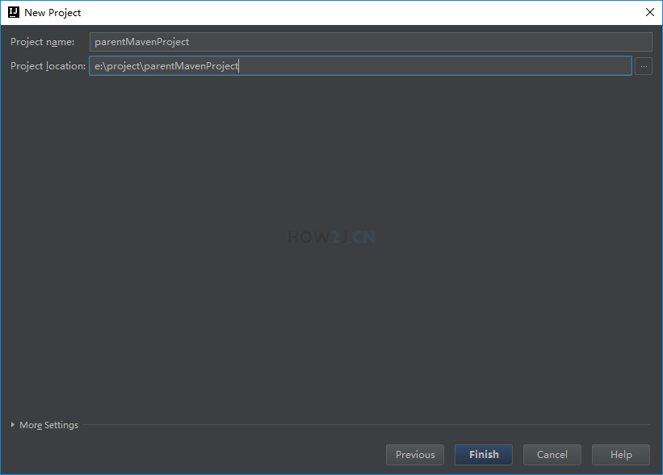

所谓的子项目，其实是maven module.
右键点击 parentMavenProject->New->Module.

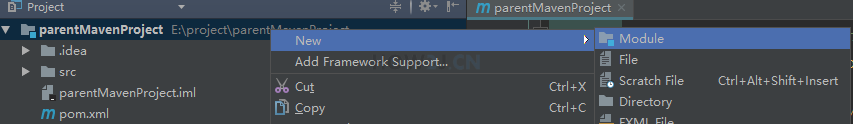

\1. 左边选择Maven
\2. 勾选Create from archetype
\3. 选择org.apache.maven.archetypes:maven-archetype-quickstart
\4. Next

输入ArtifactId: childMavenProject

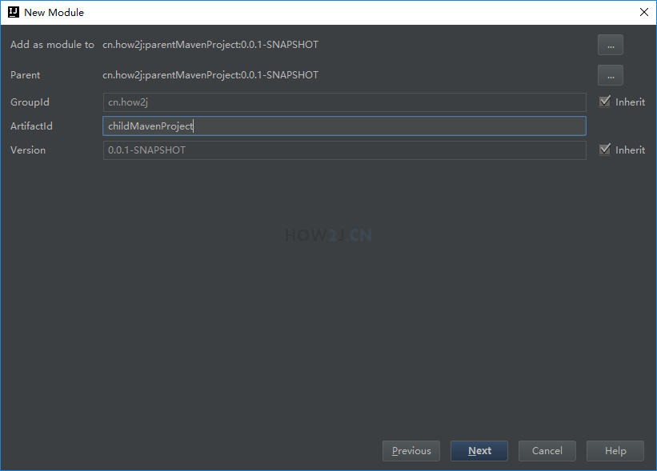

接着是一样的 maven 设置

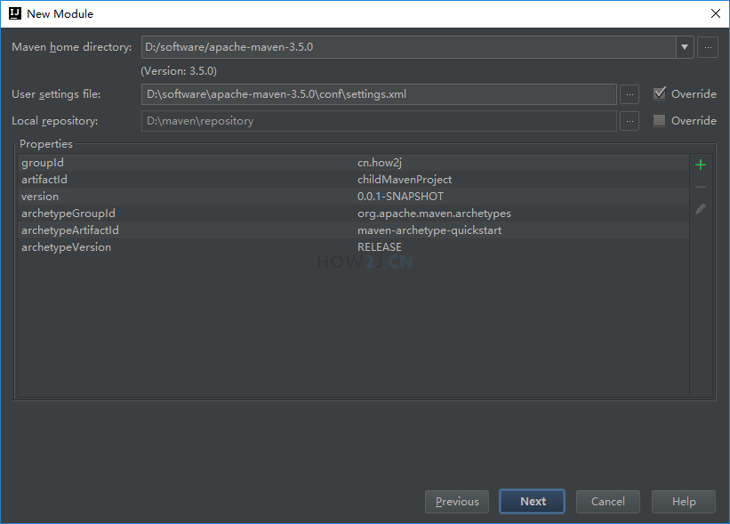

如图所示，然后点击 Finish。

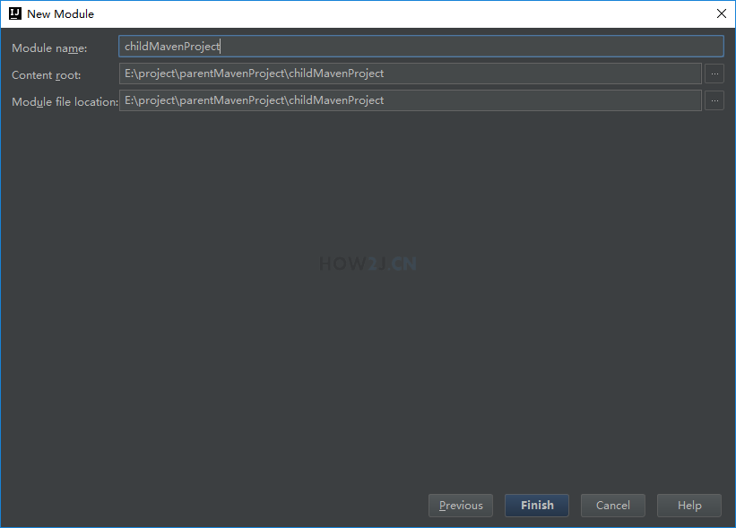

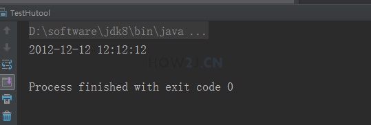

观察子项目的 pom.xml ，可以发现它多了个 parent, 这个就是对父项目的依赖。

<parent>

<artifactId>parentMavenProject</artifactId>

<groupId>cn.how2j</groupId>

<version>0.0.1-SNAPSHOT</version>

</parent>

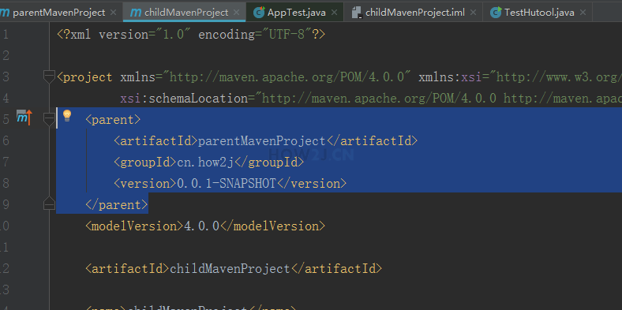

此时再打开父项目的 pom.xml ,可以发现它多了这么一个模块s, 就表示对子项目的关联。

<modules>

<module>childMavenProject</module>

</modules>

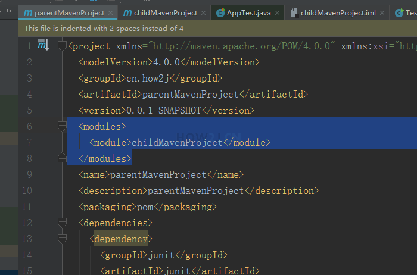

观察目录结构，可以发现 childMavenProject 是位于 parentMavenProject下面的。 所以如果将来有 childMavenProject1, childMavenProject2, childMavenProject3 也会放在这么一个目录下，就方便管理了。

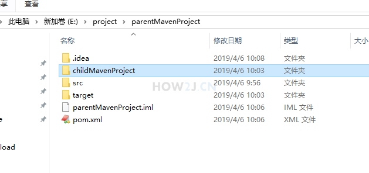

在右上角有本知识点对应的可运行项目下载 ,实在自己搞不出来，就下载解压出来比较一下。