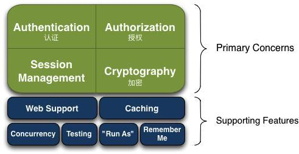

Clipped from: http://www.liuhaihua.cn/archives/506225.html

## 一、导语

今天推荐给大家一个非常简单，实用的[开源](http://www.liuhaihua.cn/archives/tag/开源)权限框架：Shiro，这也是 **Java官方推荐的权限框架** 。

尽管网上有很多类似的[文章](http://www.liuhaihua.cn/archives/tag/文章)，但是都不够完善，尤其是涉及到 freemaker，[springboot](http://www.liuhaihua.cn/archives/tag/springboot)，shiro，[redis](http://www.liuhaihua.cn/archives/tag/redis) 整合的文章非常少，并且更多的是理论，缺失完整的可运行的源[代码](http://www.liuhaihua.cn/archives/tag/代码)。

#### 本文提供的[源码](http://www.liuhaihua.cn/archives/tag/nativecode)，你可以将代码直接拷贝到自己项目使用，[参数](http://www.liuhaihua.cn/archives/tag/参数)可[配置](http://www.liuhaihua.cn/archives/tag/配置)，提供完整的文档。

源代码实现的功能：

- 提供可视化后台界面；
- [管理](http://www.liuhaihua.cn/archives/tag/管理)员后台添加用户、系统功能、角色，关联系统功能和角色,分配用户角色；
- 登录/身份[认证](http://www.liuhaihua.cn/archives/tag/authentication)；
- 权限验证；
- 会话管理（redis实现[分布式](http://www.liuhaihua.cn/archives/tag/分布式)[集群](http://www.liuhaihua.cn/archives/tag/集群)管理）；
- 缓存（redis实现分布式集群管理）；
- 登录失败次数限制（redis实现分布式集群管理）；

## 二、shiro介绍

首先，让我们先了解一下Shiro到底是什么？

Shiro是一个强大且简单易用的Java[安全](http://www.liuhaihua.cn/archives/tag/安全)框架，主要用来做认证，授权，加密，会话管理。相比于具备类似功能的

[Spring Security](http://www.liuhaihua.cn/archives/tag/spring-security)来说，Shiro要简单的多，并且满足绝大部分[企业](http://www.liuhaihua.cn/archives/tag/企业)级系统应用。

Shiro具体有哪些功能呢，下面简单列举一些：

- 登录/身份认证；
- 验证权限，即，验证某个人是否有做某件事的权限；
- 会话管理，管理用户特定的会话（支持分布式session管理），支持[web](http://www.liuhaihua.cn/archives/tag/web),非web,ejb；
- 加密，保证[数据](http://www.liuhaihua.cn/archives/tag/数据)安全；
- Caching：缓存（支持分布式[cache](http://www.liuhaihua.cn/archives/tag/cache)管理）；
- 登录失败次数限制；
- Remember Me：即记住登录状态，一次登录，下次再来的话不用重复登录；
- Run As：允许一个用户假装为另一个用户（如果他们允许）的身份进行访问；
- Shiro可以很友好的与Spring集成，支持[js](http://www.liuhaihua.cn/archives/tag/js-2)p标签（官方不支持freemaker标签，本文源码实现一套freemaker标签）；



## 三、shiro详解

本小节重点讲解 Shiro的体系结构，以及一些相关的术语。

通过认证和[权限控制](http://www.liuhaihua.cn/archives/tag/权限控制)流程的讲解，使读者基本掌握shiro的运行原理。

#### 1、[系统架构](http://www.liuhaihua.cn/archives/tag/系统架构)

Shiro有三个关键概念：

- Subject
- [Security](http://www.liuhaihua.cn/archives/tag/security)Manager
- Realms

三者的关系如下图所示：


- Subject：

  [本质](http://www.liuhaihua.cn/archives/tag/本质)上就是当前访问用户的抽象描述。Shiro对外主要提供了以Subject为核心的一些列[API](http://www.liuhaihua.cn/archives/tag/api)，各种用户验证与权限控制的接口都是围绕着Subject来设计的。

  但是所有Subject都需要SecurityManager，当你与Subject进行交互，这些交互行为实际上被转换为与SecurityManager的交互。

- SecurityManager：

  Shiro架构中最核心的组件，通过它可以协调其他组件完成用户认证和授权。

  SecurityManager就是Shiro框架的控制器，执行安全相关的操作并管理该应用的所有用户的状态。

  这些操作和状态包括：

1. 1. 用户认证；
   2. 权限控制；
   3. 回话管理；
   4. 缓存管理；
   5. Realm的协调调度；
   6. 事件传播；
   7. “Remember Me”服务；
   8. 创建Subject；
   9. 退出登录；

- Realms：

  定义了访问数据的方式，用来连接不同的数据源，如：LDAP，关系[数据库](http://www.liuhaihua.cn/archives/tag/数据库)，配置文件等等当需要与安全数据交互的时候，像用户账户，或者访问控制，Shiro就从一个或多个Realms中查找。Shiro提供了一些可以直接使用的Realms，如果默认的Realms不能满足[需求](http://www.liuhaihua.cn/archives/tag/需求)，也可以自定义Realms （本文自定义Realms，数据来源[mysql](http://www.liuhaihua.cn/archives/tag/mysql)，提供完整的数据库表结构和演示数据）。

#### 2、系统详细架构


- Authenti[cat](http://www.liuhaihua.cn/archives/tag/cat)or（用户认证管理器）

  这个组件主要用于处理用户登录逻辑，他通过调用Realm的接口来判断当前登录的用户的身份。

- AuthenticationStrategy（用户认证策略）

  如果系统配置了多个Realm，则需要使用AuthenticationStrategy来协调这些Realm以便决定一个用户登录的认证是成功还是失败。（比如，如果一个Realm验证成功了，但是其他的都失败了，那么这次认证算是成功了吗？还是说必须所有的Realm都认为成功了才算成功？或者是第一个成功就算成功？可见，策略还是蛮复杂的）。

- Authorizer（权限管理器）

  这个组件主要是用来做用户的访问控制。通俗来说就是决定用户能做什么、不能做什么。

- SessionManager（会话管理器）

  SessionManager知道如何创建会话、管理用户回话的[生命](http://www.liuhaihua.cn/archives/tag/生命)周期以便在所有运行环境下都可以给用户提供一个健壮的会话管理体验。SessionDAO允许用户使用任何类型的数据源来存储Session数据。

- SessionDAO(org.[apache](http://www.liuhaihua.cn/archives/tag/apache).shiro.session.mgt.eis.SessionDAO)

  用于代替SessionManager执行Session相关的增删改查。这个接口允许我们将任意种类的数据存储方式引入到Session管理的基础框架中。

  （本文源码实现了redisDao，用redis实现session的统一管理，同时，源码还提供了内存管理session，可以通过配置方便的切换使用。）

- Cache

  缓存 authentication, authorization 和 session 等数据，提升应用的性能。由于Cache不属于安全框架的核心功能，所以shiro本身并没有完全实现Cache机制。Cache接口相当于底层的缓存框架的顶层接口，shiro的一切的缓存操作都与这个Cache顶层接口操作，而底层的实现可以是任何Cache[实例](http://www.liuhaihua.cn/archives/tag/实例)（JAche、Ehcache、RedisCache，OSCache、JBossCache..）

  （本文源码实现了Ehcache，RedisCache 和内存Cache。三者可以通过配置，方便的切换使用。）

- CacheManager(org.apache.shiro.cache.CacheManager)

  缓存管理器。创建和管理缓存，为 authentication, authorization 和 session management 提供缓存数据，避免直接访问数据库，提高效率。

  cacheManager维护了Cache实例的生命周期，它和Cache一样，只是shiro的缓存框架的顶层接口，具体底层实现可以是任意的。

  （本文源码实现了RedisCacheManager，用redis实现cache的统一管理。同时，源码还提供了内存和ehcache管理cache，可以通过配置，方便的切换使用。）

#### 3、其他基本概念解释

- 分布式会话管理

  将session保存到独立缓存[服务器](http://www.liuhaihua.cn/archives/tag/host)，保证服务在重启或 nginx做[负载均衡](http://www.liuhaihua.cn/archives/tag/load-balancing)的时候，用户session可见。

  #### （本文提供的源码使用redis保存session会话。）

- freemaker标签

  #### 通过使用标签，可以非常方便的实现前后端数据通信。

  默认Shiro支持jsp标签，但不支持freemaker标签。为了满足前端使用freemaker的系统使用Shiro，特[定制](http://www.liuhaihua.cn/archives/tag/private)化一套freemaker 的shiro标签，并提供源码。

## 四、shiro实战案例分享

本小节分三部分

- 数据库表介绍
- 权限管理系统源代码结构详解
- 认证&授权流程分析

#### 数据库表


#### 权限管理系统源代码结构详解

项目结构图示：


如图所示，本项目包括四个子项目

#### 1、demo-shiro-interface

项目展开如下：


该子项目主要功能是提供与用户、角色、功能、权限和[分页](http://www.liuhaihua.cn/archives/tag/分页)相关的接口类和实体。

#### 2、demo-shiro-service

项目展开如下：


该子项目主要功能是实现demo-shiro-interface中的接口类，业务逻辑编码实现。

#### 3、demo-shiro-web

项目展开如下：


其中

- UserController.[java](http://www.liuhaihua.cn/archives/tag/java-2)

  用户登录认证，登出管理，用户添加，用户审核等功能。

- SysController.java

  系统功能模块管理。

- *Tag.java

  专为freemaker定制的Shiro标签，本项目的关键部分。

- CustomShiroSessionDAO.java

  自定义session 管理，本项目提供依赖redis集中会话管理的功能，本项目的关键部分。

- RedisCacheManager.java

  自定义Cache 管理，本项目提供依赖redis集中Cache管理的功能，本项目的关键部分。

- MyShiroRealm.java

  自定义 realm，用户认证和授权均需要使用该类提供的功能，本项目的关键部分。

- [Freemarker](http://www.liuhaihua.cn/archives/tag/freemarker)Configuration.java

- ShiroTagFreeMarkerConfigurer.java

  自定义的freemaker的shiro标签注入实现。

#### 4、[spring](http://www.liuhaihua.cn/archives/tag/spring)boot-shiro-configure

项目展开如下：


其中

- *Properties.java

  读取application.yml 配置文件中对应的配置参数，如session过期[时间](http://www.liuhaihua.cn/archives/tag/时间)，连续最大登录失败次数等。

- RetryLimitHashedCredentialsMatcher.java

  管理 连续最大登录失败次数以及时间间隔，当达到最大登录失败次数后，系统提示用户N分钟内无法继续重试。

- ShiroAutoConfiguration.java ShiroConfiguration.java

  Shiro允许用户自定义Realms，CacheManager，SessionManager ，这两个类文件的功能就是实现自定义类的依赖管理。

  这两个类也是Shiro 与 spring boot 集成的关键部分。

  此处源码实现涉及到 spring boot @ConditionalOnxxx 的相关注解技术，建议读者学习相关技术点。

以上源码文件中有非常完善的[注释](http://www.liuhaihua.cn/archives/tag/注释)，有兴趣的同学可以读一读。

#### 认证&授权流程分析

Shiro 所有的功能都围绕两个核心功能展开，即用户登录认证 和用户访问授权。除这两个核心功能外，本项目还自定义了cacheManager，sessionManager，使用多种方式做cache和session管理。

本小节将对以上四个问题做[解析](http://www.liuhaihua.cn/archives/tag/解析)。

#### 1、用户登录认证

shiro用户认证时序图


通过调用Subject.login([token](http://www.liuhaihua.cn/archives/tag/token))方法开始用户认证流程。


执行 currentUser.login(token) 后 ,SecurityManager会收到AuthenticationToken,并将其发送给已配置的Realm执行必须的认证。所以这一步在调用login(token)方法时,它会走到MyRealm.doGetAuthenticationInfo()方法中,具体验证方式如下：

MyShiroRealm.doGetAuthenticationInfo()。

UserRealm继承AuthorizingRealm，在其父类AuthenticatingRealm的getAuthenticationInfo方法中会调用credentialsMatcher的 doCredentialsMatch 来验证用户输入用户名密码是否匹配。


使用HashedCredentialsMatcher来进行加密。加密方式为salt自定义（本项目使用的www）、hash次数为1024、Base64解码，加密算法为md5。

对应的配置文件applications.yml


用户注册时，密码明晚修改为密文，具体代码实现如下：


其中 Constants.initPassword 是添加用户时默认的密码：[1111](http://www.liuhaihua.cn/archives/tag/1111)11.

用户退出登录时，Shiro用户必须执行[logo](http://www.liuhaihua.cn/archives/tag/logo)ut()，必须要注销Session信息，避免影响下一次用户认证和授权

```
SecurityUtils.getSubject().logout();
req.getSession().invalidate();
```

#### 2、用户访问授权

shiro访问授权时序图


用户认证通过后，进入后台管理系统。

在后台系统使用 freemaker 构建，sidebar.flt模板文件中管理所有菜单。其中的 freemaker 的shiro 标签配置如下：


红色边框 name=“4” 或name=“4-1” 其中的 4 ，4-1 代表的下图所示 红框中的 role.getPe[rmi](http://www.liuhaihua.cn/archives/tag/rmi)ssionsName()值。


permissionsName 的值来源于 后台添加功能时，为菜单设置的值。如下图:


#### 3、session管理

系统提供两种session管理方式

- ehcache管理
- Redis集中管理

配置：

ShiroConfiguration.java


注释掉该方法时 ，shiro的会话session默认由ehcache管理。

打开该方法时，shiro的会话session由redis管理。

#### 4、cache管理

系统提供三种session管理方式

- 本地内存管理
- ehcache管理
- Redis集中管理

配置：

ShiroConfiguration.java


想使用哪种方式，就将其他另外两种方式注释掉。

（有兴趣的同学可以[开发](http://www.liuhaihua.cn/archives/tag/开发)一个新功能，通过配置参数来开启某种session管理方式）

## 五、系统配置

本小节分两个部分

- Shiro管理配置

  主要涉及到两个配置文件application.yml 和ehcache.xml ，下面会有针对各个配置参数的详细介绍。

- 后台系统权限配置

  使用后台管理系统的页面，添加用户，系统功能，角色，权限，用户权限分配。

1、Shiro **管理配置**

#### application.yml


- realm-class

  自定义 realm（com.xinwei.shiro.MyShiroRealm），完成认证和授权。

- custom-authc-filter-class:

  自定义过滤器com.xinwei.shiro.[Ajax](http://www.liuhaihua.cn/archives/tag/ajax)[Authorization](http://www.liuhaihua.cn/archives/tag/authorization)Filter。

- login-url

  登录url，会话超时继续访问系统时，自动跳转到该url。

- success-url

  认证通过后，系统进入该url功能界面。

- retry-max

  用户登录认证，允许的最大连续失败次数。

- retry-expire-time-redis

  用户登录认证，达到最大连续失败次数后，需要等待再次输入的时间间隔（单位：秒）。

  （只有当使用redis管理cache时，该参数才生效。如果使用ehcache 管理cache，则需要参考ehcache.xml。）

- authorization-expire-time-redis

  用户授权检验 的缓存过期时间，在过期时间内，用访问需要授权的菜单时，无需重复执行，提升了系统的访问效率。

  （只有当使用redis管理sesson时，该参数才生效。如果使用ehcache 管理cache，则需要参考ehcache.xml。）

- hash-iterations

  密码加密时，做的hash次数，本案例做1024次hash。

- hash-algorithm-name

  密码加密时使用的加密方法，本案例采用MD5。

- stored-credentials-hex-encoded

  默认值是true，默认采用Hex解码，false时，采用Base64解码。

- global-session-timeout

  会话存活时间（注意，单位是毫秒，0表示立即过期，-1表示永不过期）。

- validation-interval

  检查session是否过期的时间间隔。

- validation-scheduler-enabled

  true，扫描session[线程](http://www.liuhaihua.cn/archives/tag/线程),负责清理超时会话。

- filter-chain-definitions:

- /media/**: anon

  访问该[目录](http://www.liuhaihua.cn/archives/tag/directory)下的文件，不需要做权限校验。

- /admin/**: authc

  设置拦截器，访问该目录下的文件事，需要做权限校验。

#### ehcache.xml


参加具体含义参考 [https](http://www.liuhaihua.cn/archives/tag/https)://www.cnblogs.com/sdream/p/5966668.html。

#### 2、后台系统权限配置


- 添加用户


注意：新添加的后台用户，密码默认是：111111，且审核通过后才可以登录本系统。

- 为用户添加角色


- 添加系统功能：


功能编码必须唯一，在freemaker 处需要使用该功能编码。

- 添加角色


- 给角色赋权限


## 六、其他

Shiro是一个功能很齐全的框架，使用起来也很容易，但是要想用好却有相当难度。欢迎大家多动手实践，遇到问题一起讨论。

项目源码地址：

```
https://github.com/wzjgn/shiro-freemaker-springboot-redis-mysql.git
```

参考：

https://www.cnblogs.com/learnhow/p/5694876.html
