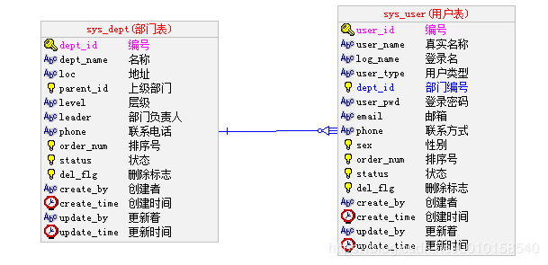
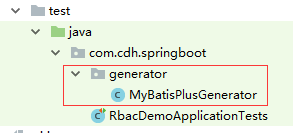
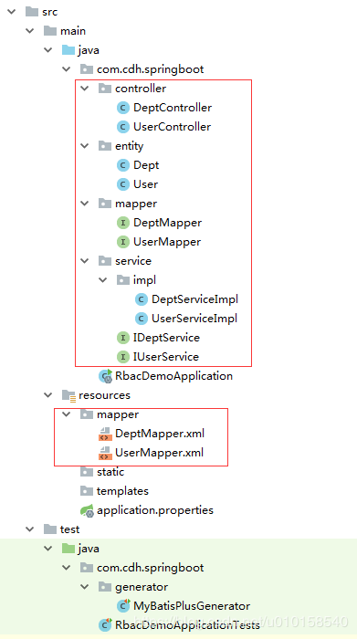
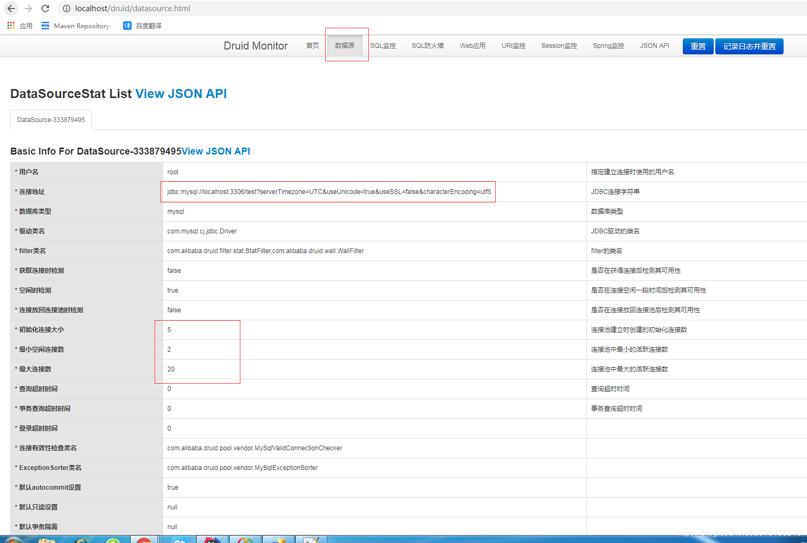
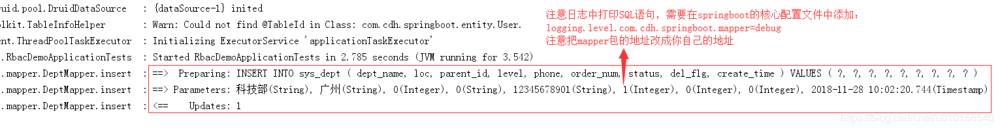
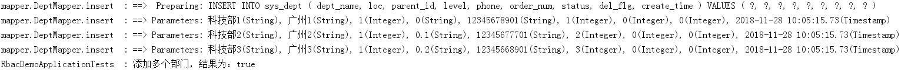
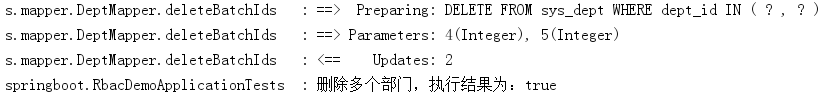
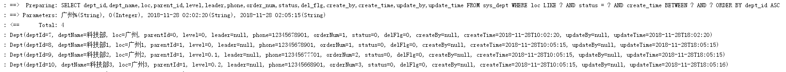
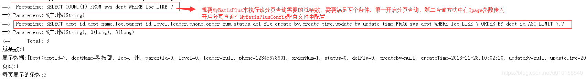
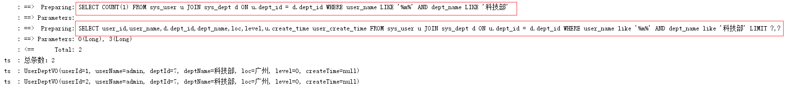

Clipped from: https://blog.csdn.net/u010158540/article/details/84524468

这篇文章主要用于学习SpringBoot以及整合MyBatisPlus和前端框架LayUI，使用的都是最新的版本：
SpringBoot2.1.0 , MyBatisPlus3.0.6 , LayUI2.4.5 ,MySQL5.5.15, 以及SpringBoot默认支持的模板引擎Thymeleaf3.0.4，使用以上技术，了解SpringBoot怎么集成以上框架技术，怎么完成XML配置的替换等…

```
本来是做一个RBAC权限管理系统的，但是这样做的话，这个博客会很臃肿，后面把它改了，重点还是介绍SpringBoot的相关知识。以及各个技术的集成，先简单的入门，后面再统一完成项目说明，就不在做技术知识点讲解了
```


## SpringBoot简介

Spring由于其繁琐的配置，一度被人认为“配置地狱”，各种XML、Annotation配置，让人眼花缭乱，而且如果出错了也很难找出原因。Spring Boot更多的是采用Java Config的方式，对Spring进行配置。
Spring Boot可以轻松创建独立的，生产级的基于Spring的应用程序，您可以直接“运行”启动服务，而不用再去配置Tomcat启动。包括静态资源处理,视图解析器，注解扫描等…

### - **SpringBoot特征**

1. 创建独立的Spring应用程序
2. 直接嵌入Tomcat，Jetty或Undertow（无需部署WAR文件）
3. 提供简洁的“入门”依赖项以简化构建配置，简化Maven配置
4. 尽可能自动配置Spring和第三方库，大部分数据源，Mapper扫描，组件注入都不用再处理，去处理繁琐的Xml配置
5. 提供生产就绪功能，例如指标，运行状况检查和外部化配置
6. 绝对没有代码生成，也不需要XML配置
7. [SpringBoot2.1.0官方学习地址](https://docs.spring.io/spring-boot/docs/2.1.0.RELEASE/reference/htmlsingle/)

###  - **依赖管理**
  每个版本的Spring Boot都提供了它支持的依赖项的精选列表。实际上，您不需要为构建配置中的任何这些依赖项提供版本，因为Spring Boot会为您管理这些依赖项。当您升级Spring Boot时，这些依赖项也会以一致的方式升级。就不用再单独使用properties来提取对应的jar包版本，SpringBoot的`parent`帮你搞定.在配置对应jar的时候，不需要再写版本号了。SpringBoot没有提供的除外。

```
<！ - 继承默认值为Spring Boot  - > 
<parent> 
	<groupId> org.springframework.boot </ groupId> 
	<artifactId> spring-boot-starter-parent </ artifactId> 
	<version> 2.1.0.RELEASE < / version> 
</ parent>
123456
```

如果需要，您仍然可以指定版本并覆盖Spring Boot的建议。当然，每个版本的Spring Boot都与Spring Framework的基本版本相关联。我们强烈建议您不要指定其版本。SpringBoot没有提供的除外.

- SpringBoot提供的应用程序启动器，也就是封装好的Maven配置常用的如下，具体查看帮助文档。

名称 描述

|                                |                                                              |
| ------------------------------ | ------------------------------------------------------------ |
| spring-boot-starter            | 核心启动器，包括自动配置支持，日志记录和YAML                 |
| spring-boot-starter-aop        | 使用Spring AOP和AspectJ进行面向方面编程的入门者              |
| spring-boot-starter-freemarker | 使用FreeMarker视图构建MVC Web应用程序的入门者                |
| spring-boot-starter-thymeleaf  | 使用Thymeleaf视图构建MVC Web应用程序的入门者                 |
| spring-boot-starter-jdbc       | 将JDBC与HikariCP连接池一起使用的入门者                       |
| spring-boot-starter-json       | 配置jackson，完成对象转换JSON的操作，需要注意的是要转换的JSON对象需要符合JavaBean规范 |
| spring-boot-starter-mail       | 使用Java Mail和Spring Framework的电子邮件发送支持的初学者    |
| spring-boot-starter-test       | 使用JUnit，Hamcrest和Mockito等库来测试Spring Boot应用程序的初学者 |
| spring-boot-starter-validation | 使用Java Bean Validation和Hibernate Validator的初学者        |
| spring-boot-starter-web        | 使用Spring MVC构建Web（包括RESTful）应用程序的入门者。使用Tomcat作为默认嵌入式容器 |
| spring-boot-starter-webflux    | 使用Spring Framework的Reactive Web支持构建WebFlux应用程序的初学者 |
| spring-boot-starter-websocket  | 使用Spring Framework的WebSocket支持构建WebSocket应用程序的初学者 |
| spring-boot-starter-logging    | 使用Logback进行日志记录的入门。默认日志启动器                |
| spring-boot-starter-log4j2     | 使用Log4j2进行日志记录的入门。替代spring-boot-starter-logging |
| spring-boot-starter-tomcat     | 使用Tomcat作为嵌入式servlet容器的入门者。使用的默认servlet容器启动器spring-boot-starter-web |
| spring-boot-starter-jetty      | 使用Jetty作为嵌入式servlet容器的入门。替代spring-boot-starter-tomcat |

### - **SpringBoot和SpringMVC常用注解**

注解名称 描述

|                                          |                                                              |
| ---------------------------------------- | ------------------------------------------------------------ |
| @SpringBootApplication                   | 包含了@ComponentScan、@Configuration和@EnableAutoConfiguration注解。其中@ComponentScan让spring Boot扫描到Configuration类并把它加入到程序上下文 |
| @ImportResource                          | 用来加载xml配置文件                                          |
| @Bean                                    | 用@Bean标注方法等价于XML中配置的bean                         |
| @Value                                   | 注入SpringBoot 核心配置文件(`application.yml > application.properties`)中属性对应的值 |
| @Configuration                           | 等同于spring的XML配置文件；使用Java代码可以检查类型安全。替代xml配置，通过@Bean完成注入，可以使用@ImportResource注解加载xml配置文件 |
| @ConfigurationProperties                 | 方法注解，用于获取核心配置文件中对应以什么开头的多个属性，并自动注入到对象中 |
| @Import                                  | 用来导入其他配置类                                           |
| @Primary                                 | 方法注解，用于标注，如果IOC容器中存在多个相同类型的Bean，优先使用被标注的Bean对象 |
| @EnableAutoConfiguration                 | 自动配置                                                     |
| @ExceptionHandler                        | 用在方法上面表示遇到这个异常就执行以下方法                   |
| @ControllerAdvice、@RestControllerAdivce | 包含@Component。可以被扫描到。统一处理异常,类注解，需要和@ExceptionHandler配合使用 |
| @ResponseBody                            | 标注返回的信息使用Json转换                                   |
| @Controller                              | 用于定义控制器类，通常方法需要配合注解@RequestMapping        |
| @RestController                          | 是@Controller和@ResponseBody的合集,表示这是个控制器bean,并且是将函数的返回值直 接填入HTTP响应体中,是REST风格的控制器 |
| @PathVariable                            | 获取参数                                                     |
| @Autowired / @Resource                   | 自动注入,获取SpringIOC容器中的bean对象                       |
| @ComponentScan                           | 组件扫描，可自动发现和装配一些Bean                           |
| @Component、@Service、@Repository        | 把当前标注的类注入到IOC容器中，需要@ComponentScan配置注解标注类路径,各个注解实现结果一致，只是应用场景不同，属于语义话注解 |

### - **其它常用注解**

#### 1. lombok注解

注解名称 描述

|                                          |                                                              |
| ---------------------------------------- | ------------------------------------------------------------ |
| @Data                                    | 注解在类上；提供类所有属性的 getting 和 setting 方法，此外还提供了equals、canEqual、hashCode、toString 方法 |
| @Setter / @Gette r                       | 注解在属性上；为属性提供 setting 方法/getting方法            |
| @Log4j2 / @Slf4j                         | 注解在类上；为类提供一个 属性名为log 的 log4j 日志对象，和@Log4j注解类似 |
| @NoArgsConstructor / @AllArgsConstructor | 注解在类上；为类提供一个无参/有参的构造方法                  |
| @EqualsAndHashCode                       | 默认情况下，会使用所有非瞬态(non-transient)和非静态(non-static)字段来生成equals和hascode方法，也可以指定具体使用哪些属性。 |
| @toString                                | 生成toString方法，默认情况下，会输出类名、所有属性，属性会按照顺序输出，以逗号分割 |
| @Builder                                 | 被注解的类加个构造者模式                                     |
| @NonNull                                 | 如果给参数加个这个注解 参数为null会抛出空指针异常            |
| @Value                                   | 注解和@Data类似，区别在于它会把所有成员变量默认定义为private final修饰，并且不会生成set方法 |
| @Synchronized                            | 加个同步锁                                                   |

#### 2. jackson注解

注解名称 描述

|                       |                                                              |
| --------------------- | ------------------------------------------------------------ |
| @JsonNaming           | 字段命名映射策略： KebabCaseStrategy: 肉串策略 - 单词小写，使用连字符’-‘连接,SnakeCaseStrategy: 蛇形策略 - 单词小写，使用下划线’_'连接；UpperCamelCaseStrategy: 驼峰策略 - 单词首字母大写其它小写，不添加连接符 |
| @JsonIgnoreProperties | 类注解，指定序列化时忽略这些属性，可以用于覆盖超类中默认输出的属性 |
| @JsonInclude          | 仅在属性不为空时序列化此字段，对于字符串，即null或空字符串   |
| @JsonIgnore           | 字段注解，序列化时忽略此字段                                 |
| @JsonProperty         | 指定序列化时的字段名，默认使用属性名                         |
| @JsonFormat           | 指定Date类字段序列化时的格式，java8 LocalDateTime序列号需要加入jsr310解析包 |
| @JsonUnwrapped        | 把成员对象中的属性提升到其容器类，并添加给定的前缀，比如上例中: User类中有name和age两个属性，不使用此注解则序列化为：… “user”: { “name”: “xxx”, “age”: 22 } …使用此注解则为：… “user_name”: “xxx”, “user_age”: 22, |
| @JsonIgnoreType       | 类注解，序列化时忽略此类                                     |

## 使用IDEA工具快速构建SpringBoot入门案例

主要目的就是了解Spring的使用原理，以及它的Java替代XML配置的写法，比如拦截器，异常处理，数据源注入，MyBatis配置信息等处理。这里使用的IDEA使用2017.3.5这个版本。


pom.xml文件和之前的springMVC中的略有差异，使用了很多SpringBoot提供的继承配置，直接在parent包中查找，大部分是不用提供版本号的。具体如下：

```
<?xml version="1.0" encoding="UTF-8"?>
<project xmlns="http://maven.apache.org/POM/4.0.0" xmlns:xsi="http://www.w3.org/2001/XMLSchema-instance"
	xsi:schemaLocation="http://maven.apache.org/POM/4.0.0 http://maven.apache.org/xsd/maven-4.0.0.xsd">
	<modelVersion>4.0.0</modelVersion>

	<groupId>com.cdh.springboot</groupId>
	<artifactId>rbac-demo</artifactId>
	<version>0.0.1-SNAPSHOT</version>
	<packaging>jar</packaging>

	<name>rbac-demo</name>
	<description></description>

	<!--SpringBoot核心依赖，是属于maven的继承父类，提供了很多集成配置，还有很多jar包的版本全局属性等。-->
	<parent>
		<groupId>org.springframework.boot</groupId>
		<artifactId>spring-boot-starter-parent</artifactId>
		<version>2.1.0.RELEASE</version>
		<relativePath/> <!-- lookup parent from repository -->
	</parent>

	<properties>
		<project.build.sourceEncoding>UTF-8</project.build.sourceEncoding>
		<project.reporting.outputEncoding>UTF-8</project.reporting.outputEncoding>
		<java.version>1.8</java.version>
	</properties>

	<dependencies>
		<!--基本上包含了jdbc操作所需的所有jar:spring-jdbc,logback,log4j,sl4j,annotation... -->
		<dependency>
			<groupId>org.springframework.boot</groupId>
			<artifactId>spring-boot-starter-jdbc</artifactId>
		</dependency>
		<!--模板引擎：thymeleaf,java8time-->
		<dependency>
			<groupId>org.springframework.boot</groupId>
			<artifactId>spring-boot-starter-thymeleaf</artifactId>
		</dependency>
		<!--spring Web模块：jackson,tomcat,validator,spring-web,webmvc-->
		<dependency>
			<groupId>org.springframework.boot</groupId>
			<artifactId>spring-boot-starter-web</artifactId>
		</dependency>
		<!--实体帮助类-->
		<dependency>
			<groupId>org.projectlombok</groupId>
			<artifactId>lombok</artifactId>
			<optional>true</optional>
		</dependency>
		<!--spring-boot-test,junit4.12,spring-test,json-path..-->
		<dependency>
			<groupId>org.springframework.boot</groupId>
			<artifactId>spring-boot-starter-test</artifactId>
			<scope>test</scope>
		</dependency>

		<!--**********以上是使用IDEA工具勾选后默认生成的，以下是我自定义添加的其他依赖包*****************-->
		<dependency>
			<groupId>mysql</groupId>
			<artifactId>mysql-connector-java</artifactId>
		</dependency>
		<!--mybatis-plus,mybatis-spring,mybatis,mybatis-plus-generator ...-->
		<dependency>
			<groupId>com.baomidou</groupId>
			<artifactId>mybatis-plus-boot-starter</artifactId>
			<version>3.0.6</version>
		</dependency>
		<!--mybatis-plus完成项目构建所需模板，真实项目不需要使用-->
		<dependency>
			<groupId>org.freemarker</groupId>
			<artifactId>freemarker</artifactId>
		</dependency>
		<!--数据源+session监控-->
		<dependency>
			<groupId>com.alibaba</groupId>
			<artifactId>druid</artifactId>
			<version>1.1.12</version>
		</dependency>
		<!-- 验证码 -->
		<dependency>
			<groupId>com.github.penggle</groupId>
			<artifactId>kaptcha</artifactId>
			<version>2.3.2</version>
		</dependency>
		<!-- 汉字转换为拼音 -->
		<dependency>
			<groupId>com.belerweb</groupId>
			<artifactId>pinyin4j</artifactId>
			<version>2.5.1</version>
		</dependency>
	</dependencies>

	<build>
		<plugins>
			<!--springBoot打包插件-->
			<plugin>
				<groupId>org.springframework.boot</groupId>
				<artifactId>spring-boot-maven-plugin</artifactId>
			</plugin>
		</plugins>
	</build>
</project>

```

### 在数据库中创建两张表，用于测试

创建表可以直接使用SQL语句完成，也可以直接在数据库UI工具中完成，当然比较建议大家使用建模工具，这样不仅可以提高建表速度，也可以提高对工具的熟练度，不要觉得麻烦，这是必须要掌握的，常用的建模工具有Power Designer和EZDML，我经常用的是后者，如果要学习它，可以查看我博客中有一篇是介绍这个工具的使用[表设计工具EZDML使用详细教程](https://blog.csdn.net/yerenyuan_pku/article/details/70217321)

表结构和字段说明如下：



SQL脚本：

### 使用MybatisPlus 的代码生成器获取所需文件

AutoGenerator 是 MyBatis-Plus 的代码生成器，通过 AutoGenerator 可以快速生成 Entity、Mapper、Mapper XML、Service、Controller 等各个模块的代码，极大的提升了开发效率。而要完成这一功能，只需要提供一个Java 可运行方法即可。文件结构如下：


```
-- sys_dept
/*
警告: 字段名可能非法 - status
*/
create table  `sys_dept`(
       `dept_id`         INT auto_increment primary key not null comment '编号',
       `dept_name`       VARCHAR(25) comment '名称',
       `loc`             VARCHAR(300) comment '地址',
       `parent_id`       INT comment '上级部门',
       `level`           VARCHAR(64) comment '层级',
       `leader`          VARCHAR(16) comment '部门负责人',
       `phone`           VARCHAR(16) comment '联系电话',
       `order_num`       INT(4) comment '排序号',
       `status`          INT(1) comment '状态',
       `del_flg`         INT(1) comment '删除标志',
       `create_by`       VARCHAR(64) comment '创建者',
       `create_time`     TIMESTAMP DEFAULT 0 comment '创建时间',
       `update_by`       VARCHAR(64) comment '更新着',
       `update_time`     TIMESTAMP DEFAULT CURRENT_TIMESTAMP ON UPDATE CURRENT_TIMESTAMP comment '更新时间'
);
alter table `sys_dept` comment= '部门表';

-- sys_user
/*
警告: 字段名可能非法 - status
*/
create table  `sys_user`(
       `user_id`         INT auto_increment primary key not null comment '编号',
       `user_name`       VARCHAR(32) comment '真实名称',
       `log_name`        VARCHAR(32) comment '登录名',
       `user_type`       VARCHAR(8) comment '用户类型 系统用户,临时用户',
       `dept_id`         INT comment '部门编号',
       `user_pwd`        VARCHAR(64) comment '登录密码',
       `email`           VARCHAR(32) comment '邮箱',
       `phone`           VARCHAR(14) comment '联系方式',
       `sex`             INT(1) comment '性别',
       `order_num`       INT(4) comment '排序号',
       `status`          INT(1) comment '状态',
       `del_flg`         INT(1) comment '删除标志',
       `create_by`       VARCHAR(64) comment '创建者',
       `create_time`     TIMESTAMP DEFAULT 0 comment '创建时间',
       `update_by`       VARCHAR(64) comment '更新者',
       `update_time`     TIMESTAMP DEFAULT CURRENT_TIMESTAMP ON UPDATE CURRENT_TIMESTAMP comment '更新时间'
);
alter table `sys_user` comment= '用户表';

alter  table `sys_user` add constraint `FK_sys_user_dept_id` foreign key (`dept_id`) references `sys_dept`(`dept_id`);

需要注意的是在MySQL5.7之前的版本在同一张表中写入两个日期字段必须有一个default 0否则无法执行.
```

MyBatisPlusGenerator.java文件信息

```
package com.cdh.springboot.generator;

import com.baomidou.mybatisplus.core.toolkit.StringPool;
import com.baomidou.mybatisplus.generator.AutoGenerator;
import com.baomidou.mybatisplus.generator.InjectionConfig;
import com.baomidou.mybatisplus.generator.config.*;
import com.baomidou.mybatisplus.generator.config.po.TableInfo;
import com.baomidou.mybatisplus.generator.config.rules.NamingStrategy;
import com.baomidou.mybatisplus.generator.engine.FreemarkerTemplateEngine;
import org.junit.Test;

import java.util.ArrayList;
import java.util.List;

public class MyBatisPlusGenerator {

    @Test
    public void codeGenerator() {
        // 代码生成器
        AutoGenerator mpg = new AutoGenerator();

        // 全局配置
        GlobalConfig gc = new GlobalConfig();
        String projectPath = System.getProperty("user.dir");
        gc.setOutputDir(projectPath + "/src/main/java");
        gc.setAuthor("CDHong");//Mapper,Service类注解中显示创建人信息
        //gc.setBaseColumnList(true); //在Mapper.xml文件中是否生成公用SQL代码段
        //gc.setBaseResultMap(true);  //在Mapper.xml文件中是否生成公用返回集合ResultMap
        gc.setOpen(false);  //文件生成完毕后，是否需要打开所在路径
        mpg.setGlobalConfig(gc);

        // 数据源配置
        DataSourceConfig dsc = new DataSourceConfig();
        dsc.setUrl("jdbc:mysql://localhost:3306/test?serverTimezone=UTC&useUnicode=true&useSSL=false&characterEncoding=utf8");
        dsc.setDriverName("com.mysql.cj.jdbc.Driver");
        dsc.setUsername("root");
        dsc.setPassword("root");
        mpg.setDataSource(dsc);

        // 包配置
        PackageConfig pc = new PackageConfig();
        pc.setParent("com.cdh.springboot");  //父级公用包名，就是自动生成的文件放在项目路径下的那个包中
        mpg.setPackageInfo(pc);

        // 自定义配置
        InjectionConfig cfg = new InjectionConfig() {
            @Override
            public void initMap() {
                // to do nothing
            }
        };
        List<FileOutConfig> focList = new ArrayList<>();
        focList.add(new FileOutConfig("/templates/mapper.xml.ftl") {
            @Override
            public String outputFile(TableInfo tableInfo) {
                // 自定义Mapper.xml文件存放的路径
                return projectPath + "/src/main/resources/mapper/"
                        + tableInfo.getEntityName() + "Mapper" + StringPool.DOT_XML;
            }
        });
        cfg.setFileOutConfigList(focList);
        mpg.setCfg(cfg);
        mpg.setTemplate(new TemplateConfig().setXml(null));

        // 策略配置
        StrategyConfig strategy = new StrategyConfig();
        strategy.setNaming(NamingStrategy.underline_to_camel);  //Entity文件名称命名规范
        strategy.setColumnNaming(NamingStrategy.underline_to_camel); //Entity字段名称
        strategy.setEntityLombokModel(true); //是否使用lombok完成Entity实体标注Getting Setting ToString 方法
        //strategy.setRestControllerStyle(true); //Controller注解使用是否RestController标注,否则是否开启使用Controller标注
        strategy.entityTableFieldAnnotationEnable(true); //是否在Entity属性上通过注解完成对数据库字段的映射
        strategy.setControllerMappingHyphenStyle(true);  //Controller注解名称，不使用驼峰，使用连字符
        strategy.setTablePrefix("sys_");  //表前缀，添加该表示，则生成的实体，不会有表前缀，比如sys_dept 生成就是Dept
        //strategy.setFieldPrefix("sys_");  //字段前缀
        mpg.setStrategy(strategy);
        mpg.setTemplateEngine(new FreemarkerTemplateEngine());
        mpg.execute();
    }
}

```

- 生成结果如图所示：
  

## SpringBoot启动类

SpringBoot启动类就是用于项目的启动，而启动方式是使用java的applications方式启动，即在包根目录下添加启动类，必须包含main方法，再添加Spring Boot启动方法：

- SpringApplication.run(SampleController.class, args);
- new SpringApplicationBuilder().run(args);
  不再使用之间的Tomcat部署，war包启动。简化了我们项目部署的步骤。文件内容如下：

```
package com.cdh.springboot;

import org.mybatis.spring.annotation.MapperScan;
import org.springframework.boot.SpringApplication;
import org.springframework.boot.autoconfigure.SpringBootApplication;


//这是一个组合注解，包含了@Configuration,@EnableAutoConfiguration,@ComponentScan。
//@Configuration : 标识这为一个配置文件类型，可以通过@Bean注解来标注配置文件中的Bean对象
//@EnableAutoConfiguration ： 能够自动配置spring的上下文，试图猜测和配置你想要的bean类，通常会自动根据你的类路径和你的bean定义自动配置。
//@ComponentScan ： 会自动扫描指定包下的全部标有@Component的类，并注册成bean，当然包括@Component下的子注解@Service,@Repository,@Controller。
//                   前提是标注的类是当前类的子孙包中。
@SpringBootApplication
@MapperScan(basePackages = "com.cdh.springboot.mapper") //扫描自定义的Mapper接口，并注入对应的SqlSession实例
public class RbacDemoApplication {

	//SpringBoot的启动方法
	public static void main(String[] args) {
		SpringApplication.run(RbacDemoApplication.class, args);
	}

}

```

## 集成配置MyBatisPlus以及数据源

在SpringMVC中数据源配置和MyBatis相关配置都是在xml中进行的，而SpringBoot中不推荐这么写，且大部分功能都通过自动配置完成了，极少部分需要手动配置，那么这些配置都是通过Java+Annotation的方式来完成的。
新建一个包（config）用于后续的其他配置（拦截器，异常…）在这个包中创建一个MyBatisPlusConfig类用于Druid数据源和MP的分页注入:

```
package com.cdh.springboot.config;

import com.alibaba.druid.pool.DruidDataSource;
import com.alibaba.druid.support.http.ResourceServlet;
import com.alibaba.druid.support.http.StatViewServlet;
import com.alibaba.druid.support.http.WebStatFilter;
import com.baomidou.mybatisplus.extension.plugins.PaginationInterceptor;
import org.springframework.boot.context.properties.ConfigurationProperties;
import org.springframework.boot.web.servlet.FilterRegistrationBean;
import org.springframework.boot.web.servlet.ServletRegistrationBean;
import org.springframework.context.annotation.Bean;
import org.springframework.context.annotation.Configuration;
import org.springframework.context.annotation.Primary;

import javax.sql.DataSource;

@Configuration //标注它是一个配置类，类似于新建一个spring的xml配置文件
public class MyBatisPlusConfig {

    /**
     * Druid数据源配置
     * @return
     */
    @Bean("druidDataSource") //标注这是一个Bean对象,并取一个特有的名字，避免冲突
    @Primary //如果在IOC容器中找到相同类型的Bean对象，则优先使用这个
    @ConfigurationProperties(prefix = "spring.datasource.druid") //读取核心配置文件application.properties中前缀是spring.datasource.druid的数据注入到当前Bean中
    //注意配置文件中的key值需要和DataSource中对应的set方法名称一致，注意不是属性值，是set方法
    public DataSource druidDataSource(){
        return new DruidDataSource();
    }

    /**
     * 注册一个Servlet ,把Druid提供的监控Servlet注册进去，并提供一个访问路径,用户名和密码
     * 当前自定义Servlet的注册方式一致，你也可以在web.xml中配置，只是SpringBoot项目中不建议这么做
     * @return
     */
    @Bean
    public ServletRegistrationBean druidStatViewServlet(){
        //监控界面Servlet的访问设置，访问路劲为根目录下的/druid/**,Druid数据源提供了一套显示页面，StatViewServlet，只需要注入即可，
        ServletRegistrationBean servletRegistration = new ServletRegistrationBean(new StatViewServlet(),"/druid/*");
        //添加Servlet的初始值，访问这个监控界面的用户名和密码，如果不配置，则默认不需要密码，不显示登录界面
        servletRegistration.addInitParameter(ResourceServlet.PARAM_NAME_USERNAME,"admin");
        servletRegistration.addInitParameter(ResourceServlet.PARAM_NAME_PASSWORD,"admin");
        return servletRegistration;
    }

    /**
     * 过滤器注册，需要配置Druid监控器需要监控的请求和操作
     * 配置一下过滤规则，让静态资源和它自己的视图界面不拦截
     * @return
     */
    @Bean
    public FilterRegistrationBean druidStatFilter(){
        //那些信息要监控，需要定义该过滤器来进行拦截，Druid是数据源，当然只拦截请求操作了，静态资源需要放行
        FilterRegistrationBean filterRegistration = new FilterRegistrationBean(new WebStatFilter());
        //过滤器拦截路径
        filterRegistration.addUrlPatterns("/*");
        //不拦截的请求
        filterRegistration.addInitParameter(WebStatFilter.PARAM_NAME_EXCLUSIONS,"*.js,*.gif,*.jpg,*.png,*.css,*.ico,/druid/*");
        return filterRegistration;
    }

    /**
     * MyBatisPlus分页插件启用，比较简单，只需要实例化即可
     * @return
     */
    @Bean
    public PaginationInterceptor paginationInterceptor(){
        return new PaginationInterceptor();
    }

}

```

### SpringBoot核心配置文件

添加一些Druid数据源冬天配置新和MyBatisPlus的相关配置信息，这些动态信息可以直接在SpringBoot的核心配置文件中application.properites中配置，在java文件中通过@Value(key)注解注入单个值，或 @ConfigurationProperties(prefix = “spring.datasource.druid”)注入多个值。

```
#durid 数据源配置 特别注意 常规的4个字符串连接的名字，必须符合DruidDataSource的命名规则,注意是set方法，不是字段名称，比如url
spring.datasource.type=com.alibaba.druid.pool.DruidDataSource
#####自定义的配置信息，即SpringBoot中没有提供的配置，是我们自己额外提供的动态配置信息###########
spring.datasource.druid.username=root
spring.datasource.druid.password=root
spring.datasource.druid.driverClassName=com.mysql.cj.jdbc.Driver
spring.datasource.druid.url=jdbc:mysql://localhost:3306/test?serverTimezone=UTC&useUnicode=true&useSSL=false&characterEncoding=utf8
# 初始化大小，最小，最大
spring.datasource.druid.initialSize=5
spring.datasource.druid.minIdle=2
spring.datasource.druid.maxActive=20
# 配置获取连接等待超时的时间
spring.datasource.druid.maxWait=60000
# 配置间隔多久才进行一次检测，检测需要关闭的空闲连接，单位是毫秒
spring.datasource.druid.timeBetweenEvictionRunsMillis=60000
spring.datasource.druid.dbType=mysql
# 配置监控统计拦截的filters，去掉后监控界面sql无法统计，'wall'用于防火墙
spring.datasource.druid.filters=stat,wall
# 通过connectProperties属性来打开mergeSql功能（参数不同的sql合并统计）、慢SQL记录（执行时间长的sql）
spring.datasource.druid.connectionProperties=druid.stat.mergeSql=true;druid.stat.slowSqlMillis=5000

#############################SpringBoot内置的配置信息，它会自动读取注入
#mybatisplus配置
mybatis-plus.mapper-locations=mapper/*.xml
mybatis-plus.configuration.use-column-label=true
mybatis-plus.configuration.auto-mapping-behavior=full
mybatis-plus.configuration.map-underscore-to-camel-case=true
#配置SpringBoot默认的日志环境，开启打印SQL语句的Debug模式，语法：logging.level.<mapper所在包名>=debug
logging.level.com.cdh.springboot.mapper=debug

#Tomcat端口号 默认是8080端口
server.port=80
1234567891011121314151617181920212223242526272829303132
```

### 整合测试

到此整合基本完毕，我们通过启动项目访问数据源的监控页面，确认我们配置的监控没有问题，还可以通过数据源配置信息的显示来查看我们注入的druid是否成功。即核心配置文件中的信息生效没有。

- 运行SpringBoot启动类查看打印信息
- 访问localhost/druid/ 来打开监控界面，并查看数据源配置信息
  
  在浏览器上输入localhost/durid/进入数据源监控界面，因为我们配置了登录名和密码，所以会被拦截器，需要登录才能正常方法，如果没有配置则可以直接进入，不用登录。
  
  输入正确的用户名和密码，我们就可以进入到监控界面如下，可以查看到我们在核心配置文件中配置的信息生效了。到此整合就完毕了。
  

## MyBatisPlus 封装的CRUD接口

MyBatisPlus为我们封装了一套CRUD接口，提供了我们常用的方法及实现，不仅仅是Mapper接口，还有Service接口和实现以及封装了一个条件构造器，为我们的简单条件提供了便利，具体情况可以通过[官网](http://mp.baomidou.com/guide/crud-interface.html#mapper-crud-接口)去了解，在这里我就简单罗列一下：

### Mapper CRUD 接口

**说明:**
通用 CRUD 封装BaseMapper接口，为 Mybatis-Plus 启动时自动解析实体表关系映射转换为 Mybatis 内部对象注>入容器
泛型 T 为任意实体对象
参数 Serializable 为任意类型主键 Mybatis-Plus 不推荐使用复合主键约定每一张表都有自己的唯一 id 主键
对象 Wrapper 为 条件构造器

Mapper接口 Mapper接口 Mapper接口 Mapper接口 Mapper接口 Mapper接口 Mapper接口 Mapper接口 Mapper接口

|             |            |             |            |                |            |            |                |                |
| ----------- | ---------- | ----------- | ---------- | -------------- | ---------- | ---------- | -------------- | -------------- |
| insert      | deleteById | deleteByMap | delete     | deleteBatchIds | updateById | update     | selectById     | selectBatchIds |
| selectByMap | selectOne  | selectCount | selectList | selectMaps     | selectObjs | selectPage | selectMapsPage |                |

### Service CRUD 接口

**说明:**
通用 Service CRUD 封装IService接口，进一步封装 CRUD 采用 get 查询单行 remove 删除 list
查询集合 page 分页 前缀命名方式区分 Mapper 层避免混淆， 泛型 T 为任意实体对象 建议如果存在自定义通用 Service
方法的可能，请创建自己的 IBaseService 继承 Mybatis-Plus 提供的基类 对象 Wrapper 为 条件构造器

Service接口 Service接口 Service接口 Service接口 Service接口 Service接口 Service接口 Service接口 Service接口

|                 |              |                   |            |             |        |             |            |        |
| --------------- | ------------ | ----------------- | ---------- | ----------- | ------ | ----------- | ---------- | ------ |
| save            | saveBatch    | saveOrUpdateBatch | removeById | removeByMap | remove | removeByIds | updateById | update |
| updateBatchById | saveOrUpdate | getById           | listByIds  | listByMap   | getOne | getMap      | getObj     | count  |
| list            | page         | listMaps          | listObjs   | pageMaps    |        |             |            |        |

### 条件构造器

QueryWrapper(LambdaQueryWrapper) 和 UpdateWrapper(LambdaUpdateWrapper) 的父类
用于生成 sql 的 where 条件, entity 属性也用于生成 sql 的 where 条件，`特别注意的是，因为是直接应用于SQL，所以它们其中使用的参数key都是数据库中表的字段名称，和实体属性没有关系。`

条件方法 条件方法 条件方法 条件方法 条件方法 条件方法 条件方法 条件方法 条件方法

|          |         |            |             |         |           |      |         |            |
| -------- | ------- | ---------- | ----------- | ------- | --------- | ---- | ------- | ---------- |
| allEq    | eq      | ne         | gt          | ge      | lt        | le   | between | notBetween |
| like     | notLike | likeLeft   | likeRight   | isNull  | isNotNull | in   | notIn   | inSql      |
| notInSql | groupBy | orderByAsc | orderByDesc | orderBy | having    | or   | and     | last       |

- QueryWrapper对象特有的方法：select
- UpdateWrapper对象特有的方法：set , setSql

### 使用SpringBootTest熟悉一下MyBatisPlus提供的CRUD接口

SpringBootTest的使用方式和之前的spring-test+junit的模式差不多，只需要在测试类上配置如下几个点：

- 在类上添加第一个注解： @RunWith(SpringRunner.class)
- 在类上添加第二个注解： @SpringBootTest
- 在需要测试的方法上添加@Test即可，需要注意的是，测试的方法必须是`public void` 开头的
- 如果需要注入对象在类中直接使用@Autowired 或 @Resource 放在对应的字段上即可

```
package com.cdh.springboot;

import org.junit.Test;
import org.junit.runner.RunWith;
import org.springframework.boot.test.context.SpringBootTest;
import org.springframework.test.context.junit4.SpringRunner;

@RunWith(SpringRunner.class)
@SpringBootTest
public class RbacDemoApplicationTests {
	
	@Resource
	private IDeptService deptService; //这里可以使用接口类型接收(多态)，也可以使用实现类接收。
	
	@Test
	public void contextLoads() {
	}

}


```

#### 接下来我们测试几个常见的方法

- **添加一个** ，代码如下：

```
	@Test
  	public void saveDeptTest() {
  		//给Dept实体类添加lombok的@Builder注解，就可以使用如下的方式构建对象
  		Dept dept = Dept.builder().deptName("科技部").loc("广州").parentId(0).level("0").phone("12345678901")
  		                   .orderNum(1).status(0).delFlg(0).createTime(LocalDateTime.now()).build();
  		boolean flg = deptService.save(dept);
  		System.out.println(flg);
  	}
12345678
```

执行结果，以及SQL打印信息：


#### - **添加多个**，代码如下

```
	@Test
	public void saveBatchDeptTest(){
		Dept dept1 = Dept.builder().deptName("科技部1").loc("广州1").parentId(1).level("0").phone("12345678901").orderNum(1).status(0).delFlg(0).createTime(LocalDateTime.now()).build();
		Dept dept2 = Dept.builder().deptName("科技部2").loc("广州2").parentId(1).level("0.1").phone("12345677701").orderNum(2).status(0).delFlg(0).createTime(LocalDateTime.now()).build();
		Dept dept3 = Dept.builder().deptName("科技部3").loc("广州3").parentId(1).level("0.2").phone("12345668901").orderNum(3).status(0).delFlg(0).createTime(LocalDateTime.now()).build();

		List<Dept> list = Arrays.asList(dept1,dept2,dept3);
		boolean flg = deptService.saveBatch(list);
		//这里使用日志打印，在要打印的类上添加lombok注解@Slf4j,它会提供一个log对象，我们就可以使用它打印统一样式的日志信息了
		log.info("添加多个部门，结果为：{}",flg);
	}

```

执行结果为：


#### - **根据id删除**，代码如下：

```
	@Test
	public void delByIdTest(){
		boolean flg = deptService.removeById(1);
		log.info("删除1号部门，执行结果为：{}",flg);
	}
12345
```

执行结果为：


- **根据ids删除**，代码如下：

```
	@Test
	public void delByIdsTest(){
		List<Integer> ids = Arrays.asList(4, 5);
		boolean flg = deptService.removeByIds(ids);
		log.info("删除多个部门，执行结果为：{}",flg);
	}
123456
```

执行结果为：


#### - **根据id修改**，代码如下：

```
	@Test
	public void updateById(){
		Dept dept = Dept.builder().deptId(1).deptName("市场部").build();
		boolean flg = deptService.updateById(dept);
		log.info("修改部门，执行结果为：{}",flg);
	}
123456
```

#### - **查询所有**，代码如下：

```
	@Test
	public void findAll(){
		//查询所有，注意需要添加有参构造和无参构造 @AllArgsConstructor ， @NoArgsConstructor
		List<Dept> list = deptService.list();
		list.forEach(System.out::println);
	}
123456
```

#### - **根据id查询**，代码如下：

```
@Test
	public void findById(){
		Dept dept = deptService.getById(7);
		log.info(dept.toString());
	}
12345
```

#### - **根据自定义条件查询**，代码如下：

```
	@Test
	public void findByInfo(){
		//自定义查询条件，这个时候就需要使用MyBatisPlus提供的条件构造器QueryWrapper<T>了
		//条件如下loc like '广州%' and status = 0 and create_time between '2018-11-28 02:02:20' and '2018-11-28 02:05:15' order by dept_id
		Map<String,Object> where = new HashMap<>();
		where.put("status",0);
		QueryWrapper<Dept> queryWrapper = new QueryWrapper<>();
		queryWrapper.likeRight("loc","广州")
					.eq("status",0)
					.between("create_time","2018-11-28 02:02:20","2018-11-28 02:05:15")
					.orderByAsc("dept_id");
		List<Dept> list = deptService.list(queryWrapper);
		list.forEach(dept -> log.info(dept.toString()));
	}

```

执行结果，以及打印的SQL语句如下：


#### - **分页查询**，代码如下：

```
	@Test
	public void page(){
		Page<Dept> page = new Page<>(1,3); //current:页码 ， size：每页显示的条数
		QueryWrapper<Dept> queryWrapper = new QueryWrapper<>();
		queryWrapper.like("loc","广州").orderByAsc("dept_id");
		IPage<Dept> pageInfo = deptService.page(page, queryWrapper);
		log.info("总条数:{}",pageInfo.getTotal());
		log.info("显示数据:{}:",pageInfo.getRecords());
		log.info("页码:{}",page.getCurrent());
		log.info("每页显示的条数:{}",page.getSize());
	}
1234567891011
```

执行结果，以及打印的SQL语句如下：


#### - **多表带条件分页查询** ，多表查询需要自定义SQL，也就是需要在Mapper映射文件中添加自己的需求，这个时候需要自定映射实体，也就是经常所见的VO。我们先添加一个员工，外键关联部门表，然后查询该员工对应的部门信息。
  `添加多个员工：`

```
@Autowired
private IUserService userService;

@Test
public void saveBatch(){
	//给User实体添加三个注解@NoArgsConstructor	@AllArgsConstructor	@Builder
	User user1 = User.builder().userName("admin").userPwd("admin").createTime(LocalDateTime.now()).deptId(7).build();
	User user2 = User.builder().userName("zhangsan").userPwd("zhangsan").createTime(LocalDateTime.now()).deptId(8).build();
	User user3 = User.builder().userName("lis").userPwd("lisi").createTime(LocalDateTime.now()).deptId(9).build();
	List<User> users = Arrays.asList(user1,user2,user3);
	boolean flg = userService.saveBatch(users);
	log.info("添加多个员工，执行结果为：{}",flg);
}

```

在entity包中添加一个vo包，在该包下添加一个UserDeptVO类，定义要获取的信息字段。如下：

```
import lombok.Data;

import java.time.LocalDateTime;

@Data
public class UserDeptVO {
    private Integer userId;
    private String userName;

    private Integer deptId;
    private String deptName;
    private String loc;
    private String level;
    private LocalDateTime createTime;
}

```

在UserMapper中添加两个接口，一个查询员工详细信息，一个带条件的分页查询。

```
package com.cdh.springboot.mapper;

import com.baomidou.mybatisplus.core.metadata.IPage;
import com.cdh.springboot.entity.User;
import com.baomidou.mybatisplus.core.mapper.BaseMapper;
import com.cdh.springboot.entity.vo.UserDeptVO;
import org.apache.ibatis.annotations.Param;

import java.util.List;

/**
 * <p>
 * 用户表 Mapper 接口
 * </p>
 *
 * @author CDHong
 * @since 2018-11-27
 */
public interface UserMapper extends BaseMapper<User> {

    UserDeptVO findByUserId(Integer userId);

    /**
     * 分页查询一定要添加IPage作为参数，传入页码和每页显示的条数
     * @param page
     * @param vo 查询的条件
     * @return
     */
    List<UserDeptVO> userPage(IPage<UserDeptVO> page,@Param("vo") UserDeptVO vo);
}

```

Mapper.xml中SQL映射信息如下;

```
<?xml version="1.0" encoding="UTF-8"?>
<!DOCTYPE mapper PUBLIC "-//mybatis.org//DTD Mapper 3.0//EN" "http://mybatis.org/dtd/mybatis-3-mapper.dtd">
<mapper namespace="com.cdh.springboot.mapper.UserMapper">

    <select id="findByUserId" resultType="com.cdh.springboot.entity.vo.UserDeptVO">
        SELECT user_id,user_name,d.dept_id,dept_name,loc,level,u.create_time user_create_time
        FROM sys_user u
        JOIN sys_dept d ON u.dept_id = d.dept_id WHERE user_id = #{userId}
    </select>

    <select id="userPage" resultType="com.cdh.springboot.entity.vo.UserDeptVO">
        SELECT user_id,user_name,d.dept_id,dept_name,loc,level,u.create_time user_create_time
        FROM sys_user u
        JOIN sys_dept d ON u.dept_id = d.dept_id
        <where>
            <if test="vo!=null">
                <if test="vo.userId!=null"> AND user_id = #{vo.userId}</if>
                <if test="vo.userName!=null"> AND user_name like '%${vo.userName}%' </if>
                <if test="vo.deptId!=null"> AND d.dept_id = #{vo.deptId} </if>
                <if test="vo.deptName!=null"> AND dept_name like '${vo.deptName}' </if>
                <if test="vo.loc!=null"> AND d.loc like '${vo.loc}' </if>
            </if>
        </where>
    </select>

</mapper>

```

IUserService接口中添加一个查询方法，基本上和UserMapper接口中的方法一致，你可以直接粘贴复制过去，这里就不在提供代码了，接着在UserServiceImp实现类中完成接口的实现，这里需要注入UserMapper的实例，注意这里想要获取到UserMapper实例，需要在SpringBoot的启动类中添加注解扫描Mapper接口(`@MapperScan(basePackages = "com.cdh.springboot.mapper")`)，否则会报找不到对应的方法`

```
package com.cdh.springboot.service.impl;

import com.baomidou.mybatisplus.core.metadata.IPage;
import com.cdh.springboot.entity.User;
import com.cdh.springboot.entity.vo.UserDeptVO;
import com.cdh.springboot.mapper.UserMapper;
import com.cdh.springboot.service.IUserService;
import com.baomidou.mybatisplus.extension.service.impl.ServiceImpl;
import org.springframework.stereotype.Service;

import javax.annotation.Resource;
import java.util.List;

/**
 * <p>
 * 用户表 服务实现类
 * </p>
 *
 * @author CDHong
 * @since 2018-11-27
 */
@Service
public class UserServiceImpl extends ServiceImpl<UserMapper, User> implements IUserService {

    @Resource
    private UserMapper userMapper;

    @Override
    public UserDeptVO findById(Integer userId) {
        return userMapper.findByUserId(userId);
    }

    @Override
    public List<UserDeptVO> userPage(IPage<UserDeptVO> page, UserDeptVO vo) {
        return userMapper.userPage(page,vo);
    }

}

```

Junit测试，根据ID获取对应的多表数据

```
@Test
public void findUserAndDeptByUserId(){
	UserDeptVO userDeptVO = userService.findById(2);
	log.info(userDeptVO.toString());
}

@Test
public void userPage(){
	UserDeptVO vo = new UserDeptVO();
	vo.setDeptName("科技部");
	vo.setUserName("m");
	Page<UserDeptVO> page = new Page<>(1,3);
	List<UserDeptVO> list = userService.userPage(page, vo);
	log.info("总条数：{}",page.getTotal());
	list.forEach(userDeptVO -> log.info(userDeptVO.toString()));
}

```

测试结果以及打印SQL语句如下：


接下来是把我们写好的方法通过Thymeleaf模板进行数据展示。

## Thymeleaf模板引擎简单入门

SpringBoot建议使用模板引擎Thymeleaf替代JSP的操作，Thymeleaf是面向Web和独立环境的现代服务器端Java模板引擎，能够处理HTML，XML，JavaScript，CSS甚至纯文本。
Thymeleaf的主要目标是提供一个优雅和高度可维护的创建模板的方式。为了实现这一点，它建立在自然模板的概念上，将其逻辑注入到模板文件中，不会影响模板被用作设计原型。这改善了设计的沟通，弥合了设计和开发团队之间的差距。也就是可以动态更改路径和数据。

注意在SpringBoot中Thymeleaf是开箱即用的，不需要做什么配置，当然如果你有其他需求，也可以更改默认配置，直接在SpringBoot的核心配置文件中写入对应的键值对即可。

### - **SpringBoot中 Thymeleaf常见配置项：**

```
# Thymeleaf模板引擎配置

#开启模板缓存（默认值：true）  
spring.thymeleaf.cache=true

#在呈现模板之前检查模板是否存在
spring.thymeleaf.check-template=true

#检查模板位置是否正确(默认值:true)  
spring.thymeleaf.check-template-location=true

#Content-Type的值（默认值：text/html）  
spring.thymeleaf.servlet.content-type=text/html

#开启MVC Thymeleaf视图解析(默认值：true)  
spring.thymeleaf.enabled=true

#模板编码  
spring.thymeleaf.encoding=UTF-8

#要被排除在解析之外的视图名称列表，用逗号分隔  
spring.thymeleaf.excluded-view-names=

#在构建URL时添加到视图名称前的前缀（默认值：classpath:/templates/）  
spring.thymeleaf.prefix=classpath:/templates/

#在构建URL时添加到视图名称后的后缀（默认值：.html）  
spring.thymeleaf.suffix=.html

#可解析的视图名称列表，用逗号分隔  
spring.thymeleaf.view-names=

```

- Thymeleaf使用详情：

  Thymeleaf模板引擎使用其实功能和JSP差不多，都是在静态页面对后台作用域中的数据进行相应的处理，替换默认值，逻辑判断，循环遍历，简单表达式计算，路径映射…

  ### 1. 语法

  - **引入静态资源文件：** 在html中，资源文件路径是一个头痛的问题，而模板引擎中，只需要使用`@{/url}`包裹路径，则代表该路径从项目根目录开始。之前的路径不用删除，它会自动替换。`th:href="@{/css/public.css}"`
  - **访问后端作用域数据：** 访问model中的数据,和EL表达式一致, `th:attr="class= ${btn.code}"` , 访问session中的数据需要加上作用域，`th:text="${session.currUser.relName}"`
  - **条件判断**：在html标签中，加入th:if = 表达式，可以根据条件显示html元素
  - **循环迭代**：在要循环的标签上添加 th:each 或者单独构建一个块标签：th:block:

```
    <th:block th:each="job : ${jobs}">
         <option th:text="${job.name}" th:value="${job.id}"></option>
    </th:block>
123
```

### 2. 表达式

#### - **简单表达式** ： 　${…} 变量表达式 ， *{…} 选择变量表达式 ， @{…} 链接url表达式

#### - **字面量表达式**： 文本 ->‘one text’ ， 数值->5 ，布尔->true ，空值->null ，

#### - **操作符**: 算术运算符，布尔运算符(and,or,!,not)，关系运算符(gt , lt , ge , le , eq , ne ,>= , <= , == ),三目运算

#### - **表达式工具对象**：
  \1. #dates 与java.util.Date对象的方法对应，格式化、日期组件抽取等等
  \2. #calendars 类似#dates，与java.util.Calendar对象对应
  \3. #numbers 格式化数字对象的工具方法
  \4. #strings 与java.lang.String对应的工具方法：contains、startsWith、prepending/appending等等
  \5. #objects 用于对象的工具方法
  \6. #bools 用于布尔运算的工具方法
  \7. #arrays 用于数组的工具方法
  \8. #lists 用于列表的工具方法
  \9. #sets 用于set的工具方法
  \10. #maps 用于map的工具方法
  \11. #aggregates 用于创建数组或集合的聚合的工具方法
  \12. #messages 用于在变量表达式内部获取外化消息的工具方法，与#{…}语法获取的方式相同
  \13. #ids 用于处理可能重复出现（例如，作为遍历的结果）的id属性的工具方法

#### - **页面操作：**

  内嵌标记 内嵌标记 内嵌标记 内嵌标记 内嵌标记 内嵌标记 内嵌标记 内嵌标记

|           |              |                |                 |                |                |             |             |
| --------- | ------------ | -------------- | --------------- | -------------- | -------------- | ----------- | ----------- |
| th:action | th:align     | th:alt-title   | th:autocomplete | th:cellpadding | th:cellspacing | th:class    | th:attr     |
| :async    | th:autofocus | th:autoplay    | th:checked      | th:disabled    | th:hidden      | th:readonly | th:required |
| :selected | th:each      | th:classappend | th:styleappend  | th:attrappend  |                |             |             |

  以上写法可能比较怪异，可以使用HTML5友好的属性及元素名来完成操作，...

#### - **条件运算：** th.switch 、 th:if 不只运算布尔条件，它对以下情况也运算为true:

1. 值不为null ， 为boolean且为true ，值为数字且非0 ， 值为字符且非0 ， 值是字符串且不是：“false”,“off”，“no” ， 值不是boolean、数字、字符、字符串 ， 如果值为null，则th:if运算结果为false
2. th:if的反面是th:unless

```
  <div th:switch="${user.role}">
　　<p th:case="'admin'">User is an administrator</p>
　　<p th:case="#{roles.manager}">User is a manager</p>
　　<p th:case="*">User is some other thing</p>
 </div>
12345
```

#### - **循环遍历：** th:each 除了获取对象外，还可以得到获取一些遍历状态，通过指定状态变量iterStat获取：拥有的属性(index ，count，size，current，even，odd，first，last)，`若不指定状态变量，Thymeleaf会默认生成一个名为“变量名Stat”的状态变量`:

```
<tr th:each="prod,iterStat : ${prods}" th:class="${iterStat.odd}? 'odd'">
　　<td th:text="${prod.name}">Onions</td>
　　<td th:text="${prod.price}">2.41</td>
　　<td th:text="${prod.inStock}? #{true} : #{false}">yes</td>
 </tr>
 <tr th:each="prod : ${prods}" th:class="${prodStat.odd}? 'odd'">
 　　<td th:text="${prod.name}">Onions</td>
 　　<td th:text="${prod.price}">2.41</td>
 　　<td th:text="${prod.inStock}? #{true} : #{false}">yes</td>
 </tr>

```