Clipped from: https://blog.csdn.net/weixin_30770783/article/details/98879140?depth_1-utm_source=distribute.pc_relevant.none-task-blog-BlogCommendFromBaidu-1&utm_source=distribute.pc_relevant.none-task-blog-BlogCommendFromBaidu-1

**首先你需要一个github账号，所有还没有的话先去注册吧！**

**https://github.com/**

**我们使用git需要先安装git工具，这里给出下载地址，下载后一路直接安装即可：**

**https://git-for-windows.github.io/**

**1.进入Github首页，点击New repository新建一个项目
**

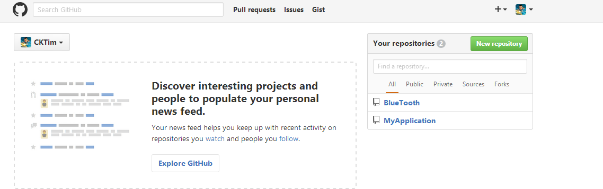

 **2.填写相应信息后点击create即可** 

**Repository name: 仓库名称**

**Description(可选): 仓库描述介绍**

**Public, Private : 仓库权限（公开共享，私有或指定合作者）**

**Initialize this repository with a README: 添加一个README.md**

**gitignore: 不需要进行版本管理的仓库类型，对应生成文件.gitignore**

**license: 证书类型，对应生成文件LICENSE**

 

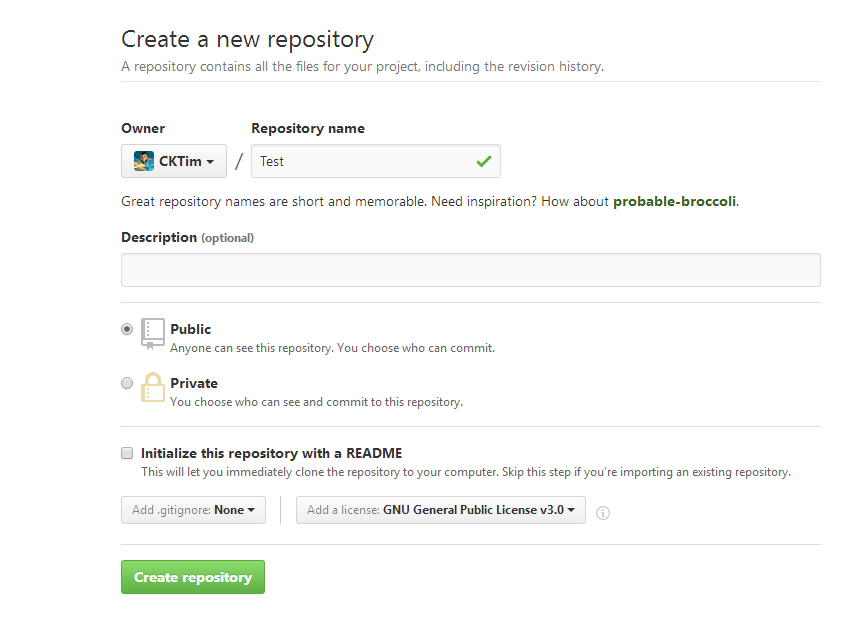

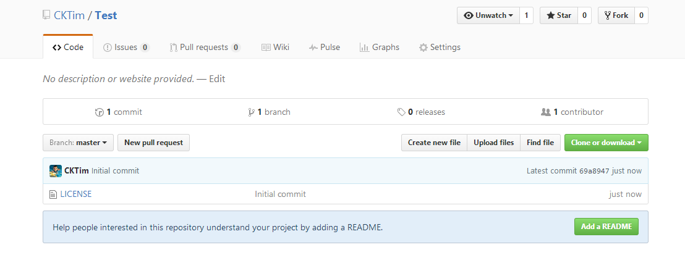

**4.点击Clone or dowload会出现一个地址，copy这个地址备用。**

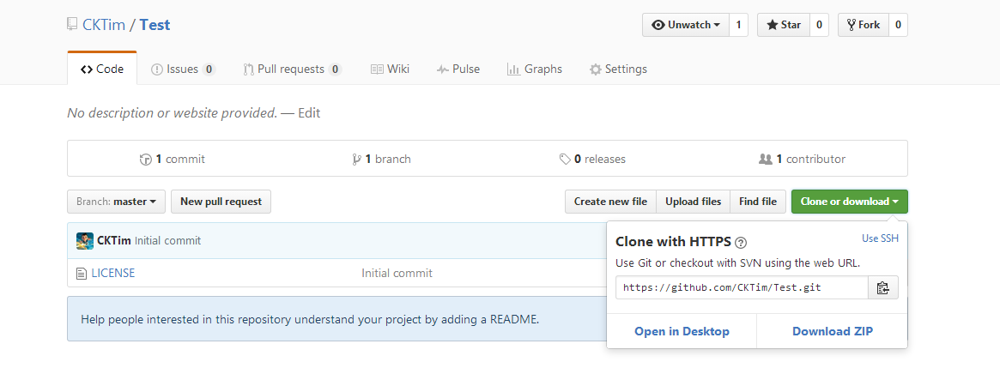

**5.接下来就到本地操作了，首先右键你的项目，如果你之前安装git成功的话，右键会出现两个新选项，分别为Git Gui Here,Git Bash Here,这里我们选择Git Bash Here，进入如下界面，Test_Bluetooth即为我的项目名。**

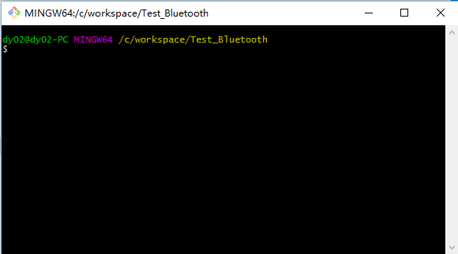

**6.接下来输入如下代码（关键步骤），把github上面的仓库克隆到本地**

**git clone https://github.com/CKTim/BlueTooth.git（https://github.com/CKTim/BlueTooth.git替换成你之前复制的地址）**

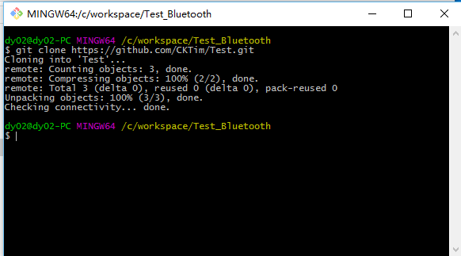

 **7.这个步骤以后你的本地项目文件夹下面就会多出个文件夹，该文件夹名即为你github上面的项目名，如图我多出了个Test文件夹，我们把本地项目文件夹下的所有文件（除了新多出的那个文件夹不用），其余都复制到那个新多出的文件夹下，**

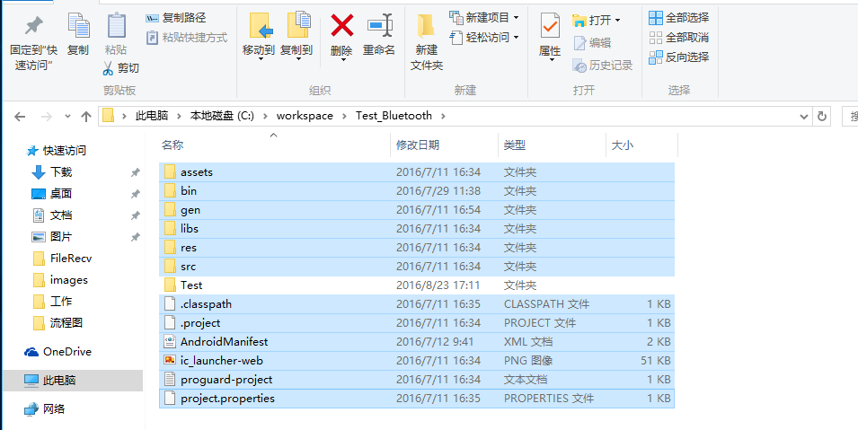

**8.接着继续输入命令 cd Test，进入Test文件夹**

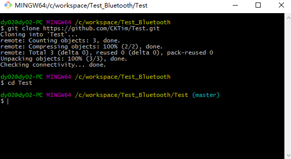

**9.接下来依次输入以下代码即可完成其他剩余操作：**

**git add .     （注：别忘记后面的.，此操作是把Test文件夹下面的文件都添加进来）**

**git commit  -m  "提交信息"  （注：“提交信息”里面换成你需要，如“first commit”）**

**git push -u origin master  （注：此操作目的是把本地仓库push到github上面，此步骤需要你输入帐号和密码）**

 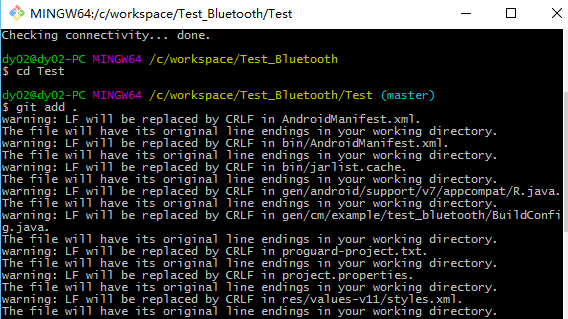

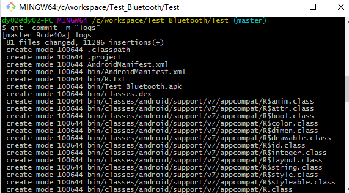

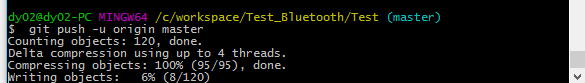

 