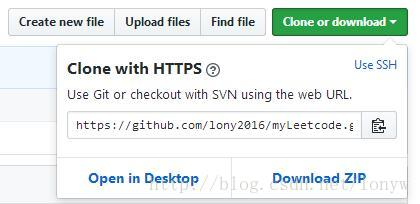
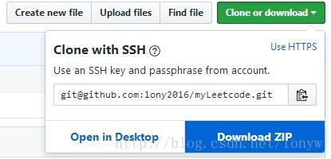
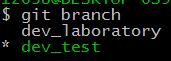
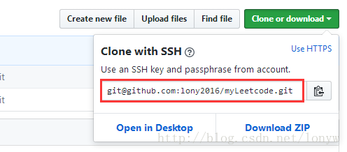

Clipped from: https://blog.csdn.net/lonyw/article/details/75392410

本文章适用于新手使用github配置本地免密连接。本地是在win10系统下利用Git 64工具拉取的。
因为git支持两种传输协议，ssh和https方式。本文讲解的是ssh方式，而不是https的方式。我们可以从github上进入项目上查看两种方式：
HTTPS方式


ssh方式


### 一 建立本地分支

我们这里主要介绍本地配置ssh方式来免用户名和密码方式提交代码

#### **1.先从远端拉取分支代码**

$ git clone https://github.com/lony2016/myLeetcode -b dev_laboratory 

**https：**这是你的代码地址；
**-b dev_laboratory：**是你项目的分支代码。

#### **2.在本地建立自己的分支:比如dev_test**


$ git branch [分支名字] （或者git checkout -b dev_test(分支名字)） 


**切换到自己的分支上并查看是否切换成功**

$ git branch 


**切换成功**

**注意：**在github上建立的项目要是第一次拉取下来后建立分支尚未设置分支的用户名和邮箱时，把新建立的本地分支提交到远端会提交不成功，需要设置用户名和密码

$ git config –global user.name “xxxxname”  $ git config –global user.email “171xxxx887@qq.com” 


### 二 ssh方式实现pull push 免密

#### **1.在本地生成ssh密钥对**

已安装好Git 64的话，直接右键菜单中选择Git bash here即可。
**warn:**最好在C:\Users\xxxxx\ .ssh(**打开你的.ssh的目录**)目录下打开Git bash，或者把生成的文件移动到/.ssh/目录下。
**输入如下命令：**

$ ssh-keygen -t rsa -C “171xxxx887@qq.com” 


**“171xxxx887@qq.com：”**换成自己的邮箱。
出现提示一直回车，全部设置成默认值即可。
（**注意：**可能有人想把文件名更改成自己喜欢的，这个时候可能需要注意一下，后面详说）


#### **2.把在本地生成ssh公玥复制到github上**

$ cat ~/.ssh/id_rsa.pub 

把出现的内容包括ssh开头和已邮箱结尾的全部内容复制下来，打开github，登录进入自己的账户，点击自己账号的头像，点击setting，在打开的网页中点击屏幕左边的SSH and GPG keys，在出现的界面下，点击New SSH key,然后把之前赋值的内容复制进key下面的框内即可，title随便你取。

账号头像->setting->SSH and GPG keys->New SSH key->添加title名字和公玥->Add SSH key 

#### **3.验证添加的key是否成功**

ssh -T git@github.com 

如果出现如下提示，则表明key添加成功

Hi lxxxxxxx6! You’ve successfully authenticated, but GitHub does not provide shell access. 

但是有些到这一步可能回报**Permission denied (publickey)**的错误，我的原因如下：

是在生成密钥对时，把生成的默认文件名换成我习惯的文件名：

Enter file in which to save the key (“当前所在路径/id_rsa(默认的文件名)”): “id_rsa_leetcode(更改成新名字)” 

这样一来，你设置的文件名并没有加入到ssh设定的默认查找的文件名中，ssh会默认查找id_rsa、id_dsa、id_ecdsa这三个文件，然后就不尝试其他了。所以就出现了上述错误
**Permission denied (publickey)解决办法[1]**

$ ssh-agent bash  $ ssh-add ~/.ssh/id_rsa_leetcode(你起的新名字) 


然后再尝试输入ssh -T git@github.com就可以了。 虽然上述问题解决了Permission denied (publickey)的问题，但当我们把当前的Git窗口关闭，重新打开一个时，又会出现这个错误了，这是因为：
**ssh-agent 是一个用于存储私钥的临时性的 session 服务，也就是说当你重启之后，ssh-agent 服务也就重置了[2]。**具体这个问题怎么解决，这里就不深追究了。


**推荐设置：**由于重新起名字会造成上述麻烦，推荐新手还是设置成默认的名字即可。感兴趣的可以去深究此问题。

#### **4.本地提交代码免密码提交（ssh方式）**

使用如下命令：git remote -v，会出现如下内容：

$ git remote -v origin https://github.com/lony2016/myLeetcode.git (fetch) origin https://github.com/lony2016/myLeetcode.git (push) 


出现上述内容说明还是通过https方式访问的。

下面把访问方式改为ssh方式，输入如下命令：

$ git remote set-url origin git@github.com:lony2016/myLeetcode.git

**git@github.com:lony2016/myLeetcode.git：**是你自己项目的地址，登录你的github，如下图：

找到你的上述图片红框中的地址，复制出来即可。再用git remote -v查看一下，是否设置成功，当地址出现以git@开始的就是设置成功。

$ git remote -v origin git@github.com:lony2016/myLeetcode.git (fetch) origin git@github.com:lony2016/myLeetcode.git (push) 


### **三 本地代码提交**

按顺序输入如下代码：

$ git add 文件名（文件多的话用*：git add *） $ git commit -m “此次提交说明” $ git push origin dev_test(你分支的名字) 

对于push时，为什么使用git push origin dev_test(你分支的名字)做个简短说明：

**Git push与pull的默认行为[3]**

(1)push.default的默认行为：git的全局配置中，有一个push.default属性，其决定了git push操作的默认行为。根据git的不同版本，git push 会出现两种不同的结果：

a. push成功，把本地分支push到远端的同名的分支上（2.0版本以前）

b.push失败，会出现如下错误:（2.0版本以后）

```java
fatal: The current branch new has no upstream branch.  

To push the current branch and set the remote as upstream, use  

git push –set-upstream origin dev_test  


```


所以，2.0版本以后就必须显式指定将要推送的分支名：如

git push origin dev_test

(2)push.default 的可供选择的值：

**nothing matching upstream simple current**
其用途分别为：
**nothing：**这种方式 push必须显式指定远程分支，例如git push origin develop。

**matching：**这种方式push时，本地和远程两端都必须含有同名分支才行。

**upstream：**此种方式push当前分支到它的upstream分支上（这一项其实用于经常从本地分支push/pull到同一远程仓库的情景，这种模式叫做central workflow）。

**simple：**这种方式，非常类似与upstream模式，但simple必须保证本地和remote的分支同名，否则会push失败。

**current:** 对于push本地的分支到remote上同名的分支，但如果远端没有相同名字的分支，则会在远端创建此分支

所以，git 2.0版本以前，push.default 默认设置成matching，只需git push即可。

git 2.0版本之后，push.default默认值为simple。必须指定当前分支的upstream，不然就会报上述哪个错误。必须使用git push –set-upstream origin dev_test。

要想改变push.default的默认值，两种方式，一种是直接到C:\Users\xxxxx(你的用户名下)\ .gitconfig（与.ssh文件夹在同一目录）文件打开修改，也可使用命令：**git config –global push.default ‘option’**将**option**换成上述5种方式的一种即可。


参考:
[1]https://my.oschina.net/alvin404/blog/205745
[2]https://segmentfault.com/q/1010000000835302
[3]https://segmentfault.com/a/1190000002783245